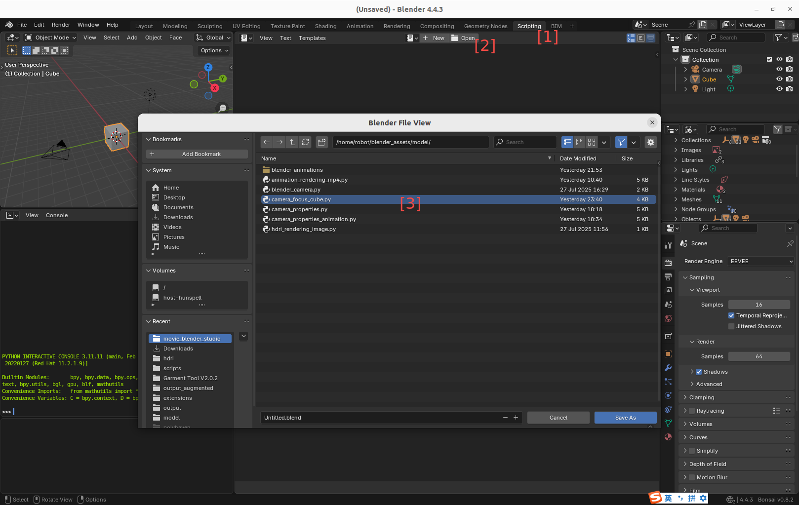
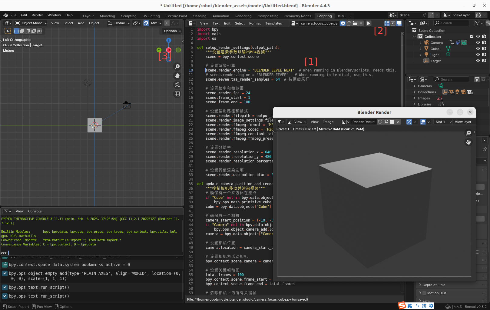

# AI coder, camera movement and video generation

## 1. Objective

This article discussed the following topics,

1. How to use AI coder, especial Google gemini-cli and Alibaba qwen3-coder to generate Blender python scripts,
2. How to configurate camera's properties and control its movement,
3. How to generate mp4 video clip via Blender.

&nbsp;
## 2. AI coder

We use Google's [gemini-cli](https://github.com/google-gemini/gemini-cli) and Alibaba's [qwen3-coder](https://qwenlm.github.io/blog/qwen3-coder/) to help us to learn and to use Blender python. Both gemini-cli and qwen3-coder are poweful, easy to use, and cheap. 

Using the gemini-cli and qwen3-coder, we can easily do the following, 

1. Write Blender python script and even an entire project from scratch,
2. Fix bugs,
3. Add more functionality to an existent script.

Following prompts illustrate how to instruct the gemini-cli and qwen3-coder to do the 3 tasks. 

~~~
# 1. Write Blender python script and even an entire project from scratch
> In Blender python, how many properties that a camera has, and how to use them. Please give me a sample python script.

# 2. Fix bugs
> In @/home/robot/movie_blender_studio/camera_properties.py, line 32, "camera.data.cycles.panorama_type = 'EQUIRECTANGULAR'  # 全景类型", when running it, it throws exception "AttributeError: 'Camera' object has no attribute 'cycles'". Can you fix the bug?

# 3. Add more functionality to an existent script
> Please modify the python script @/home/robot/movie_blender_studio/camera_focus_cube.py, so that when the script controls the camera movement in Blender, it also generate a mp4 video recording the view of the camera. 
~~~

&nbsp;
## 3. Camera focus and movement

We use qwen3-coder to generate a Blender python script, modify it, and fix bugs, so that the script can do the following tasks,

1. How to configurate camera's properties and control its movement,
2. How to generate mp4 video clip via Blender.

The Blender python script, [camera_focus_cube.py](./src/camera_focus_cube.py), is well annotated.

&nbsp;
## 4. How to run the script

There are two ways to run the script. 

### 4.1 In a ubuntu terminal

~~~
# 1. Activate the conda env, so that all packages are available to use. 
robot@robot-test:~/movie_blender_studio$ conda activate tripoSG

(tripoSG) robot@robot-test:~/movie_blender_studio$ ls
animation_rendering_mp4.py  blender_animations  blender_camera.py  camera_focus_cube.py  camera_properties_animation.py  camera_properties.py  hdri_rendering_image.py

(tripoSG) robot@robot-test:~/movie_blender_studio$ python3 camera_focus_cube.py
设置第 1 帧的相机位置: (-9.80, -5.00, 3.00)
设置第 2 帧的相机位置: (-9.60, -5.00, 3.00)
...
设置第 100 帧的相机位置: (10.00, -5.00, 3.00)
开始渲染动画视频...
Fra:1 Mem:18.09M (Peak 19.17M) | Time:00:00.08 | Syncing Cube
Fra:1 Mem:18.12M (Peak 19.17M) | Time:00:00.09 | Syncing Light
Fra:1 Mem:18.12M (Peak 19.17M) | Time:00:00.09 | Syncing Camera
Fra:1 Mem:18.12M (Peak 19.17M) | Time:00:00.09 | Syncing Target
Fra:1 Mem:18.12M (Peak 19.17M) | Time:00:00.09 | Rendering 1 / 64 samples
Fra:1 Mem:18.13M (Peak 19.17M) | Time:00:00.10 | Rendering 26 / 64 samples
Fra:1 Mem:18.13M (Peak 19.17M) | Time:00:00.10 | Rendering 51 / 64 samples
Fra:1 Mem:18.13M (Peak 19.17M) | Time:00:00.11 | Rendering 64 / 64 samples
Append frame 1
Time: 00:00.23 (Saving: 00:00.06)
...
Fra:100 Mem:18.13M (Peak 22.82M) | Time:00:00.00 | Syncing Cube
Fra:100 Mem:18.13M (Peak 22.82M) | Time:00:00.00 | Syncing Light
Fra:100 Mem:18.13M (Peak 22.82M) | Time:00:00.00 | Syncing Camera
Fra:100 Mem:18.13M (Peak 22.82M) | Time:00:00.00 | Syncing Target
Fra:100 Mem:18.13M (Peak 22.82M) | Time:00:00.00 | Rendering 1 / 64 samples
Fra:100 Mem:18.13M (Peak 22.82M) | Time:00:00.00 | Rendering 26 / 64 samples
Fra:100 Mem:18.13M (Peak 22.82M) | Time:00:00.00 | Rendering 51 / 64 samples
Fra:100 Mem:18.13M (Peak 22.82M) | Time:00:00.00 | Rendering 64 / 64 samples
Append frame 100
Time: 00:00.03 (Saving: 00:00.01)

渲染完成！视频已保存到: ./blender_animations/camera_movement.mp4
~~~

Once finishing the execution, a mp3 video clip is generated. The content of the mp3 video clip is the view of the moving camera. 

### 4.2 In a Blender 3D tool

1. Start the Blender 3D tool
   
~~~
$ which blender
/home/robot/blender-4.4.3-linux-x64/blender

$ blender
Reloading external rigs...
Reloading external metarigs...
[INFO ] services.locationservice ...............: Not adding link to MakeHuman user data, since neither explicit path nor auto-discovery is set in preferences.
[INFO ] mpfb.init ..............................: Build info 20250419
[INFO ] mpfb.init ..............................: MPFB initialization has finished.
INFO: Ucupaint 2.3.2 is registered!
register_class(...):
Info: Registering operator class: 'OBJECT_OT_AlignOperator', bl_idname 'object.align' has been registered before, unregistering previous
bl_ext.user_default.Modifier_List_Fork: Registered 62 classes
INFO: Ucupaint update routine is done in 0.13 ms!
~~~

2. Load and run the script in Blender

   

     
     &nbsp; 
     
   
  

As shown in the left screenshot above, take the following 3 steps to load the python script to the Blender 3D tool, 

  1. Click the "Scripting" on the Blender top horizontal menu,
  2. Click the "Open" button on the scripting panel,
  3. Select the script, e.g. "camera_focus_cube.py", and open it.

As shown in the right screenshot above, take the following 3 steps to run the python script in the Blender 3D tool, 

  1. Change the rendering engine to "scene.render.engine = 'BLENDER_EEVEE_NEXT'",
     The reason is that the python engine embedded in the Blender 3D tool, its version is different from the Blender python library (bpy) used in the ubuntu terminal.

  2. Click the triangle icon to run the python script,
     
  3. If you want to change the view of the cube and the camera, click the left mouse button and drag it.

Notice that,
  
  1. It takes several minutes to finish the rendering and the generation of the video clip. During this process the Blender 3D tool responds very slowly, and cannot be terminated.

  2. In case you want to terminate the Blender 3D tool, you can "kill -9 <PID>" in another terminal.
