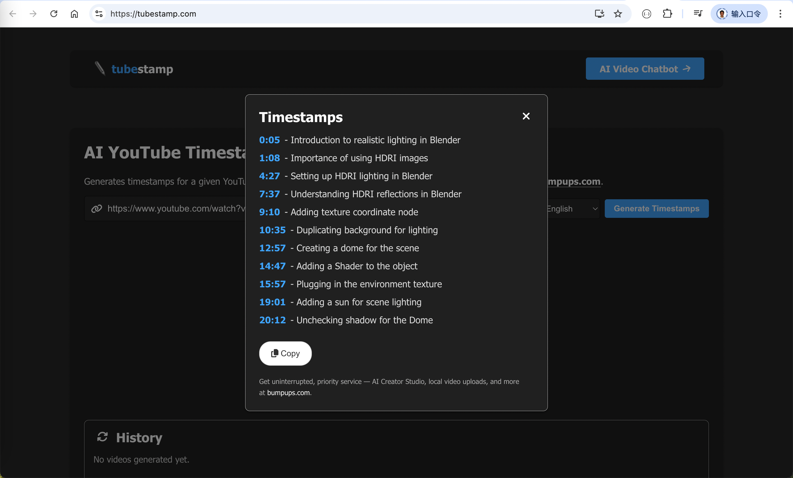
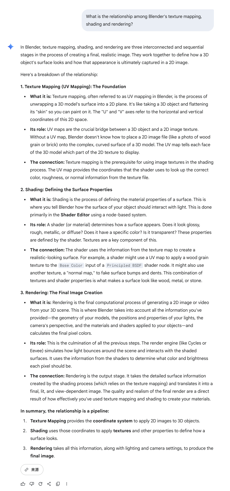
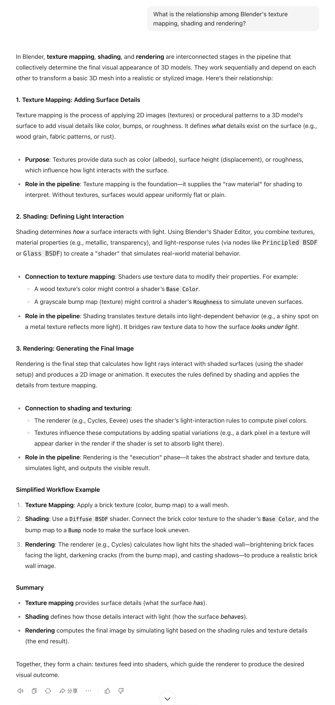
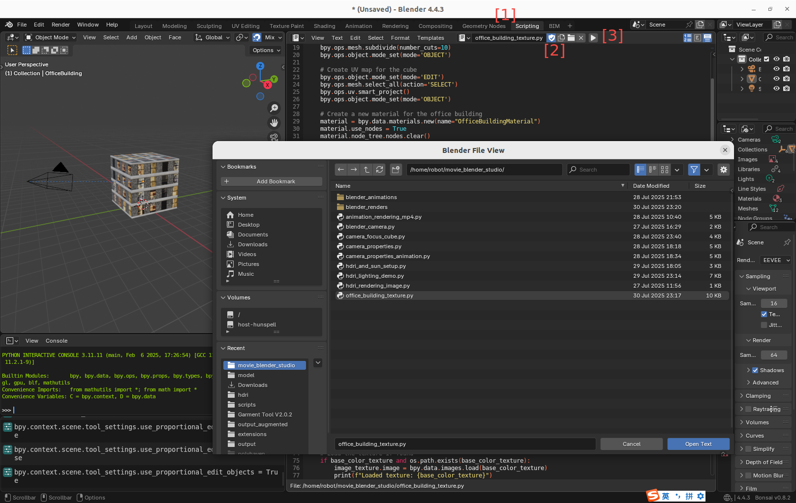
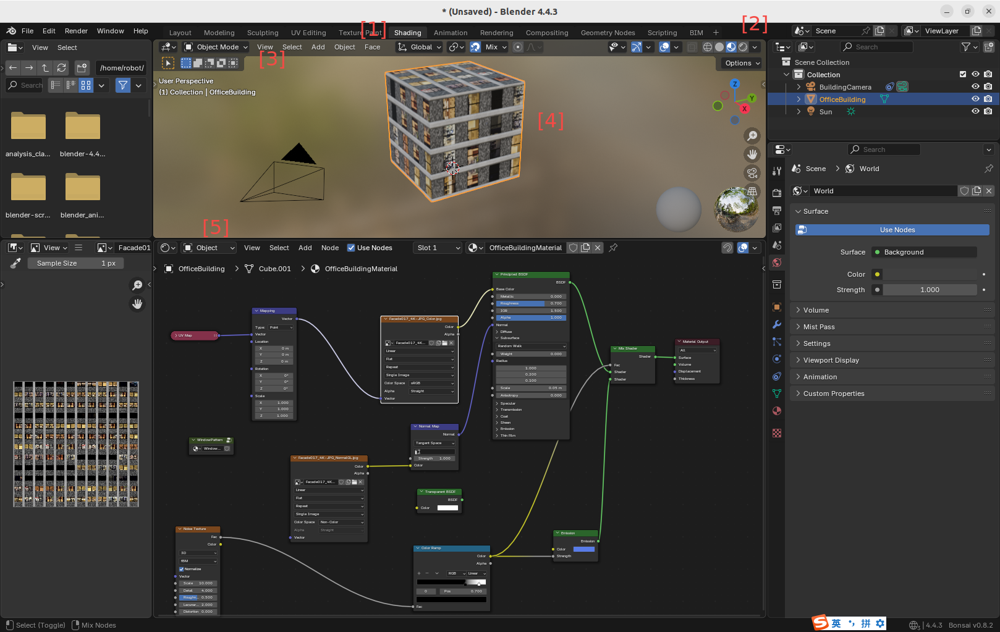

# Blender image texture mapping, shading, and online 3D asset resources

## 1. Objective

This chapter discusses how to write Blender python script, to implement image texture mapping and shading, 
as well as the related online 3D asset resources.  

&nbsp;
## 2. Textbooks, video tutorials, and AI chatbots 

How to learn Blender's concepts, principles, and functionalities?

Due to scarcity of textbook, 
our suggestion is to watch video tutorials for the basic concepts, 
and then ask AI chatbots for more details. 

### 2.1 Textbooks

It seems that [the official Blender manual](https://docs.blender.org/manual/en/latest/index.html) is not well written, 
so that it is hard to use it as a textbook to learn Blender 3D tool. 

Many people complain that,

1. There is no good textbook on Blender.

2. Ever though there are quite some video tutorials on Blender on youtube.
   However, the learning curve is quite steep, especially to remember numerous hot-keys.  
   
For example, [batm4n on Reddit](https://www.reddit.com/r/blender/comments/sxp8kp/comment/hxtrnpo/) said,

~~~
Sadly I get the impression that written material is quite a long way behind the curve compared to video tutorials.
You also have to bear in mind that many tutorials are not aimed at beginners. You need to be doing beginner specific tutorials at first.

Have you tried Grant Abitts Introduction tutorial?
He's very good for people that struggle to keep up with BlenderGuru.

You need to stop often and make notes - particularly of hotkeys.
I highly recommend repeating each tutorial from memory once you've finished.
...

BlenderGuru's 3.0 Classic Donut tutorial https://www.youtube.com/watch?v=nIoXOplUvAw&list=PLjEaoINr3zgFX8ZsChQVQsuDSjEqdWMAD

Grant Abitts 3.0 Beginners Guide https://www.youtube.com/watch?v=jnj2BL4chaQ&list=PLn3ukorJv4vuU3ILv3g3xnUyEGOQR-D8J

BlenderGuru's Chair Tutorial https://www.youtube.com/watch?v=Hf2esGA7vCc&list=PLjEaoINr3zgEL9UjPTLWQhLFAK7wVaRMR

BlenderGuru's Anvil Tutorial https://www.youtube.com/playlist?list=PLjEaoINr3zgHJVJF3T3CFUAZ6z11jKg6a
...
~~~

### 2.2 Video tutorials

Our approach is to watch the tutorial videos. 

But instead of remembering the numerous details, 
only to understand Blender 3D tool's concepts and principles. 

The drawback of video tutorials is that it is not easy to search for the segments in a video on specific topics. 

Our solution is to make timestamps for the video. 

**https://tubestamp.com** is a website that can make video timestamps especially for Youtube. 

Comparing with the original timestamps of a sample youtube video, 
the tubestamp.com generated one is different in both the number of timestamps, and the title of each segment. 

However it might be sufficiently good for content search. 

   

     
     &nbsp; 
     
   
  

### 2.3 AI chatbots

An alternative to textbooks is to ask AI chatbots. 

Following are the two answers from two AI chatbots for the same question. 

The left one is **https://gemini.google.com/app**, the right one is **https://www.doubao.com/chat**. Both are free.

   

     
     &nbsp; 
     
   
  

&nbsp;
## 3. AI coder, Blender python script, Shader nodes

### 3.1 AI coder and prompts

Almost all the operations that you can do in the Blender 3D tool, can be implemented in Blender python script. 

No need to remember all the Blender python APIs, because AI coders can do the job for you. 

Therefore, no need to remember all the Blender details, including hot-keys, because AI coders can do the job for you. 

As mentioned in Chapter 1, 
we use Google's [gemini-cli](https://github.com/google-gemini/gemini-cli) 
and Alibaba's [qwen3-coder](https://qwenlm.github.io/blog/qwen3-coder/) 
to help us to learn and to use Blender python scripts. 

Both gemini-cli and qwen3-coder are poweful, easy to use, and free. 

&nbsp;
1. For example, to write a python script from scratch
   to implement image texture mapping, shading and rendering,
   we use the following prompt.

   ~~~
   Can you please write a sample Blender python script to show how to project a texture
   in the file directory @/home/robot/blender_assets/texture/Facade017_4K to a cube,
   so that the cube looks like a modern office building,
   with the various shading nodes,
   including image texture node, UV map node, diffuse BSDF node, glossy BSDF node,
   emission node, color node, vector node, and group node, etc. 
   ~~~

2. To modify an existent code, we use the following prompt, 

   ~~~
   Can you please modify @/home/robot/movie_blender_studio/office_building_texture.py,
   so as to remove the floor underneath the cube,
   and make the facades of the building opaque?
   ~~~

3. To fix a bug, we use this prompt,

   ~~~
   When running @/home/robot/movie_blender_studio/office_building_texture.py,
   it threw a bug in line 46, "principled_node.inputs['Specular'].default_value = 0.3",
   complaining that "KeyError: 'bpy_prop_collection[key]: key "Specular" not found'"
   ~~~

Input the above prompts to gemini-cli or qwen3-coder, the AI coder will generate a Blender python script.

For example, [office_building_texture.py](./src/office_building_texture.py) is such an AI generated Blender python script. 

### 3.2 Running in Blender 3D tool

There are two ways to execute a Blender python script. 

1. The first one is to run the script in a Linux terminal, like this, 
   ~~~
   (tripoSG) robot@robot-test:~/movie_blender_studio$ python3 office_building_texture.py 
      Loaded texture: /home/robot/blender_assets/texture/Facade017_4K/Facade017_4K-JPG_Color.jpg
      Loaded normal map: /home/robot/blender_assets/texture/Facade017_4K/Facade017_4K-JPG_NormalGL.jpg
      Office building scene created with the following nodes:
      - Image texture node
      - UV map node
      - Principled BSDF node (for opaque material)
      - Emission node
      - Color nodes
      - Vector nodes (Mapping)
      - Group node (WindowPattern)
      - Normal map node
      - Noise texture node
      - Color ramp node
      Applied texture: /home/robot/blender_assets/texture/Facade017_4K/Facade017_4K-JPG_Color.jpg
      Rendering scene to: ./blender_renders/office_building_render.png
      Fra:1 Mem:20.06M (Peak 21.15M) | Time:00:00.08 | Syncing OfficeBuilding
      Fra:1 Mem:148.29M (Peak 148.29M) | Time:00:00.50 | Syncing Sun
      Fra:1 Mem:148.29M (Peak 148.29M) | Time:00:00.50 | Syncing BuildingCamera
      Fra:1 Mem:148.26M (Peak 148.29M) | Time:00:00.50 | Rendering 1 / 64 samples
      ...
      Fra:1 Mem:148.16M (Peak 148.29M) | Time:00:00.51 | Rendering 64 / 64 samples
      Saved: 'blender_renders/office_building_render.png'
      Time: 00:00.79 (Saving: 00:00.09)
      
      Rendering completed!
      Office building render saved to: ./blender_renders/office_building_render.png
   ~~~

2. The second way to run a Blender python script is in a Blender 3D tool,
   consistinng of two steps.

   The following screenshot on the left showed how to load a python script to a Blender 3D tool. 

   As shown in the left screenshot below, take the following 3 steps to load the python script to the Blender 3D tool,

   ~~~
   Step 1. click the "Scripting" on the Blender top horizontal menu.

   Step 2. click the "Open" button on the scripting panel,
           select a script in the popped-up window, e.g. "office_building_texture.py", and open it.

   Step 3. click the triangle icon to run the python script.
   ~~~

   As shown in the right screenshot below, take the following 5 steps to display and edit the shader nodes,

   ~~~
   Step 1. In the top horizontal menu, click "Shading".

   Step 2. In the central display panel, click "Viewport of shading, in material preview mode".

   Step 3. Still in the central display panel, select "Object mode" in the top left drop-down menu.

   Step 4. Click the cube to select it as the active object.

   Step 5. In the shader node panel, click "Shader type" drop-down menu, and select "Object". 
   ~~~

   

     
     &nbsp; 
     
   
  

