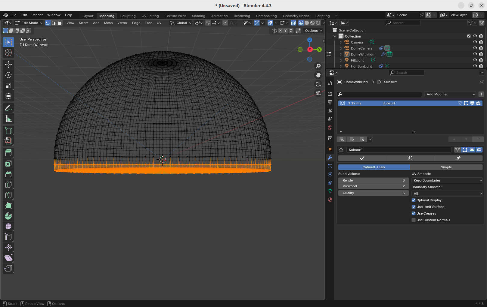
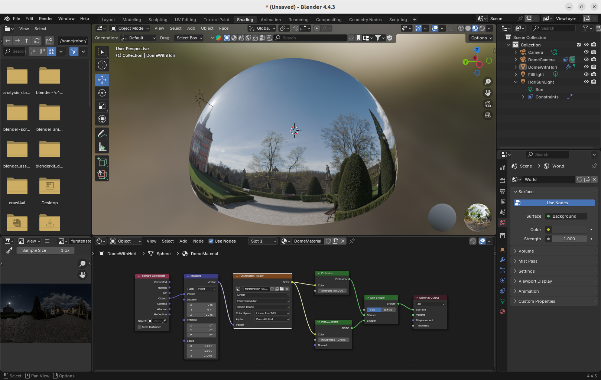
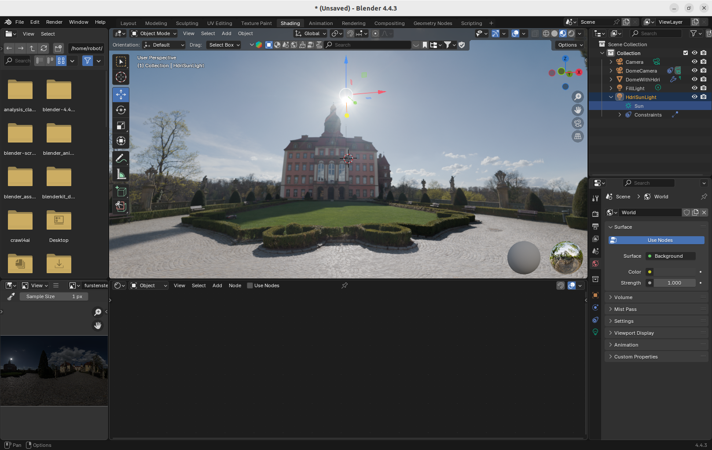
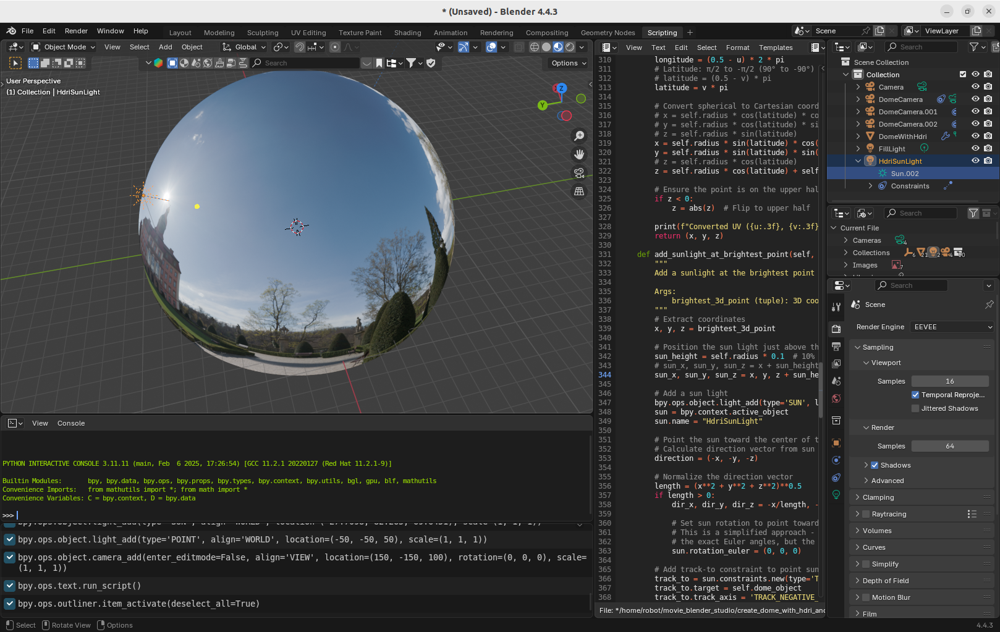

# Apply a HRDi Environmental Image to a Dome and Setup a Sun

## 1. Objective

[The Ultimate Guild to HDRI Light in Blender](https://www.youtube.com/watch?v=N3DZL56cG84)
is an excellent video tutorial by the CG Essentials, very detailed and easy to follow.

However, it is quite challenging for beginner to remember all the details. 

We create a python package to implement the procedure of this video tutorial, so that, 

1. Easy to use,
   Run the python script in a Blender 3D software, then you can get the dome with HDRi and sun.

2. No need to remember the numerous Blender hotkeys and procedures,
3. You only need to understand the concept of HDRi environmental image,
   
   the principle how to apply HDRi image to a dome,
   
   and the principle how to find the brightest spot in the HDRi image,
   then set the sun at the corresponding 3D coordinates outside the dome.

&nbsp;
## 2. AI coder prompt

We use [qwen3-coder](https://qwenlm.github.io/blog/qwen3-coder/) to write the python script. 

The prompt consists of 3 parts, totally 7 steps,

Part 1. Create a dome,
   
   Notice that the dome is not exactly the upper half of a sphere, but with a thick floor.
   
   The purpose of the thick floor is to prevent the HDRi's image distortion alone the horizon.

~~~
Can you please write a Blender python script, implementing a class called "CreateDomeWithHdri"
that is to generate a dome mesh object, with two initialization parameters,
one is the radius of the dome, the other is a file name of the HDRI texture.
In more details, 

1. Generate a sphere object first, locate it as (0, 0, 0),
   then select all the vertices whose z-coordinates are less than (-1.0 * 1/10 of the dome radius),
   and scale their z-coordinate to (-1.0 * 1/10 of the dome radius),
   but keep their x-coordinates and y-coordinates unchanged.
   So that finally you generate a upper half sphere with a flat floor.
   For the radius of the dome, let's use 100 meters as an example.
~~~

Part 2. Apply a HDRi environmental image to the dome, and configure the shader nodes. 

It consists of 3 steps.

~~~
2. Use the input HDRI to creat a texture node for the dome mesh object,
   as an example we can use a HDRI texture file @/home/robot/blender_assets/hdri/furstenstein_4k.exr. 
 
3. Add two shader nodes to the HDRI environment texture node,
   one for emission with color strength value 50, the other for diffuse BSDF,
   and link them to a mix shader node,
   then link the mix shader node to the surface of the output node. 

4. Add a texture coordinate node and a mapping node to the HDRI texture node,
   make a link from "object" of the texture coordinate node to the vector of the mapping node,
   make the z-location of the mapping node as (-1.0 * 1/5 of the dome radius).
~~~

[create_dome_with_hdri.py](./src/create_dome_with_hdri.py) implements the first two parts. 

It creates a dome and applies a HDRi image to the surface of the dome.

   

     
     &nbsp; 
     
   
  

The 3'rd part of the prompt is to set up a sun 
at a 3D coordinate corresponding to the bright spot of the HDRi image, 

The procedure consists of 3 steps.

Part 3. Setup the sun outside the dome,

   * find the brightest spot in the HDRi's image,
   * project the 2D UV coordinate of the HDRi image to the 3D coordinate of the dome,
   * setup a sun outside the dome, pointing to the 3D coordinate of the bright spot, with a distance of 1/10 of the dome radius.

~~~
5. Enumerate all the pixels in the HDRI image,
   and find the brightest 2D coordinate in the HDRI image where the nearby 4*4 pixels' sum of (R,G,B) is the maximum. 

6. Convert the 2D coordinate, of the brightest region in the 2D HDRI image
   to the 3D coordinate of the dome. 

7. Set a sunlight outside the dome, with a distance of (1/10 * dome radius) to the brightest 3D coordinate,
   with energy value equal to (100 * radius of the dome).  
~~~

[create_dome_with_hdri_and_sun.py](./src/create_dome_with_hdri_and_sun.py) implements the entire procedure from step 1 to 7. 

   

     
     &nbsp; 
     
   
  
   
&nbsp;
## 3. The tricky parts of the python script

Following are the tricky parts of the python script. 

In case the sun position is not correct, double check these tricky parts.

1. From line 272 to 280 in [create_dome_with_hdri_and_sun.py](./src/create_dome_with_hdri_and_sun.py),
   this part of the script is to find the brightest spot in 2D HDRi environmental image. 

~~~
                    # Update maximum if this is brighter
                    if brightness > max_brightness:
                        max_brightness = brightness
                        # Convert pixel coordinates to UV coordinates (0-1 range)
                        uv_u = u / (hdri_width - 1)
                        uv_v = v / (hdri_height - 1)
                        # uv_v = (v + self.radius / 10) / (hdri_height - 1)
                        # uv_v = v / (hdri_height - 1) + self.radius / 10
                        brightest_uv = (uv_u, uv_v)
~~~

2. From line 307 to 313 in [create_dome_with_hdri_and_sun.py](./src/create_dome_with_hdri_and_sun.py),
   this part of the script is to convert the 2D coordinate of the brightest spot in the HDRi environmental image,
   to the longitude and latitude of the dome. 

~~~
        # Convert UV to spherical coordinates
        # Longitude: 0 to 2π
        # longitude = u * 2 * pi
        longitude = (0.5 - u) * 2 * pi
        # Latitude: π/2 to -π/2 (90° to -90°)
        # latitude = (0.5 - v) * pi
        latitude = v * pi
~~~

3. From line 315 to 322 in [create_dome_with_hdri_and_sun.py](./src/create_dome_with_hdri_and_sun.py),
   this part of the script is to convert the longitude and latitude of the dome,
   to the 3D coordinate of the dome.
   
~~~
        # Convert spherical to Cartesian coordinates
        # x = self.radius * cos(latitude) * cos(longitude)
        # y = self.radius * cos(latitude) * sin(longitude)
        # z = self.radius * sin(latitude)
        x = self.radius * sin(latitude) * cos(longitude)
        y = self.radius * sin(latitude) * sin(longitude)
        # z = self.radius * cos(latitude)
        z = self.radius * cos(latitude) + self.radius / 10
~~~

4. From line 341 to 343 in [create_dome_with_hdri_and_sun.py](./src/create_dome_with_hdri_and_sun.py),
   this part of the script is to set the sun at the right position outside the dome.

~~~
        # Position the sun light just above the dome surface
        sun_height = self.radius * 0.1  # 10% of dome radius above surface
        sun_x, sun_y, sun_z = x, y, z + sun_height    
~~~

&nbsp;
## 4. Video demo

