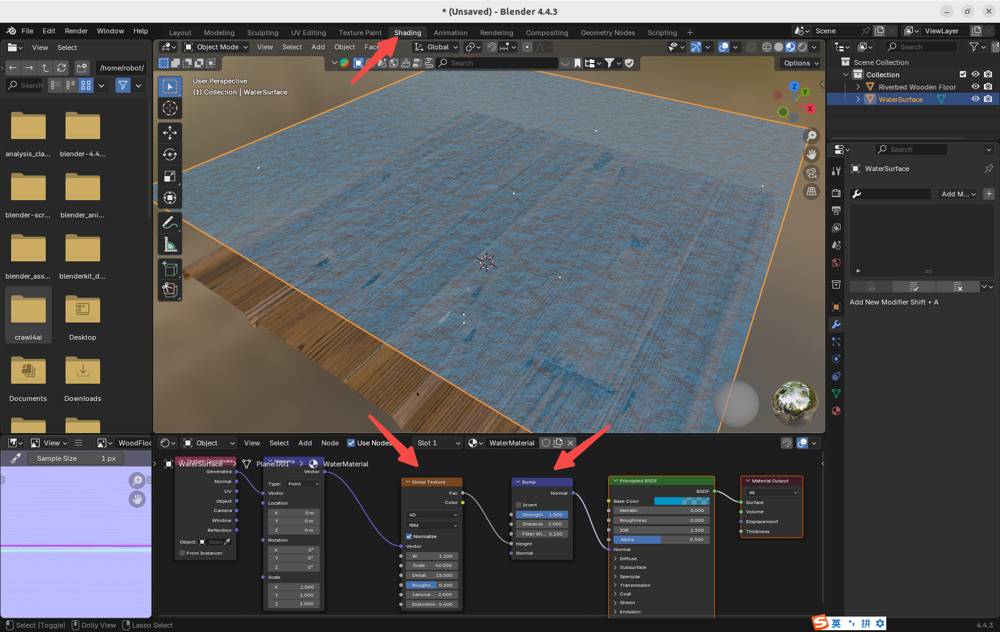
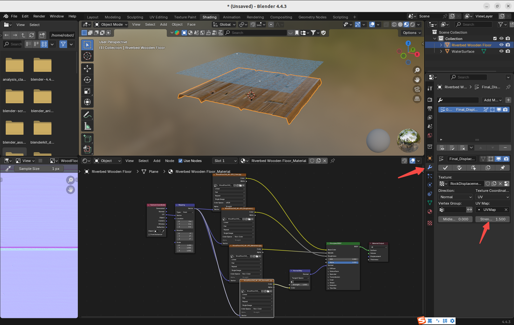

# Custom Blender Python Library

&nbsp;
## 1. Objective

This article describes how to create a custom Blender python library 
that aims at constructing virtual movie studio. 

&nbsp;
## 2. System architecture

Following is the final goal of the library framework. 

In each file folder, we will add many more python scripts. 

~~~
$ cd /home/robot/movie_blender_studio/
$ tree .
.env
├── main.py
├── sys_config
│   ├── __init__.py 
│   └── import_in_blender.py
├── shader_modifier
│   ├── __init__.py
│   ├── apply_texture_asset.py
│   ├── modifier_generator.py
│   └── shader_generator.py
├── hdri
│   ├── __init__.py
│   └── dome_with_hdri_and_sun_generator.py
├── model
│   ├── __init__.py
│   ├── rock_generator.py
│   ├── water_generator.py
│   └── river_terrain_generator.py
├── scene
│   ├── __init__.py
│   └── landscape_with_river.py
├── animation
│   ├── __init__.py
├── camera_light
│   ├── __init__.py
├── video
│   ├── __init__.py
│   └── the_early_morning_landscape_with_river.py
~~~

&nbsp;
## 3. Run demos

To run the demo, do the following

~~~
$ cd /home/robot/movie_blender_studio/

# To verify there is no error.
$ python3 main.py

# Another way to verify there is no error.
# Also, in the future, when providing cloud service to remote users,
# we will run the system in the background/headless mode. 
$ blender --background --python main.py

# To see the demo in the Blender 3D software
# the easiest way is to the following command
$ blender --python main.py
~~~

Or, load and run the "main.py" script in the Blender 3D software.

The left screenshot below shows the shader nodes for the water plane, especially the noise and bump nodes. 
The right screenshot below shows the displacement modifier that can change the vertex coordinates of the wooden floor dynamically. 

The shader nodes and modifiers can be programmed easily, using our Blender python library.

   

     
     &nbsp;
     
   
  

&nbsp;
## 4. Demo video

Click the image to jump to youtube to see our demo.

