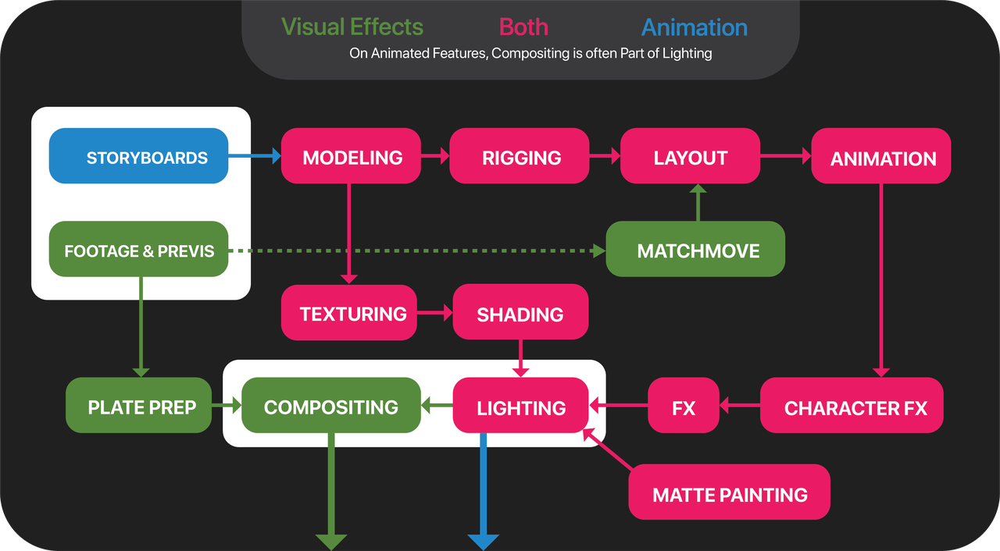

# Introduction to pyCinematic

## 1. Objectives

In chapter 07, we did four jobs. 

1. Implement compositing classes, especially cinematic_compositor.py.
   This is the first try to implement virtual cinematography based on Blender.

2. Implement video sequence editing classes, for video, audio, image, and text sequence editing.
   This is similar to [github.com/Zulko/moviepy](https://github.com/Zulko/moviepy), but based on Blender.
   
   We should learn from `moviepy` for its simple APIs. 

3. Intensively modify renderer.py, especially implement the setting for image, audio, and video.

&nbsp;
## 2. System Architecture

Following is the file structure of the scripts. 

~~~
$ cd /home/robot/movie_blender_studio
$ tree .
├── dot.env -> .env
├── __init__.py
├── main.py
│     
├── animation
│   ├── __init__.py
│   ├── animation.py
│   ├── keyframe.py
│   └── constraint.py
├── camera
│   ├── __init__.py
│   ├── camera.py
│   └── renderer.py
│     
├── editor
│   ├── __init__.py
│   └── editor_node.py
├── compositing
│   ├── __init__.py
│   ├── video_compositor.py
│   ├── cinematic_compositor.py
│   ├── color_compositor.py
│   ├── image_compositor.py
│   └── image_sequence_compositor.py
├── material
│   ├── __init__.py
│   └── texture_shader.py
│     
├── video
│   ├── __init__.py
│   ├── video_editor.py
│   ├── video_channel.py
│   ├── audio_strip.py
│   ├── image_strip.py
│   └── video_strip.py
│
├── model
│   ├── __init__.py
│   ├── rock_generator.py
│   ├── water_generator.py
│   ├── riverbed_generator.py
│   └── utils
│       ├── __init__.py
│       └── curve_generator.py
├── modifier
│   ├── __init__.py
│   └── modifier_generator.py
├── hdri
│   ├── __init__.py
│   ├── hdri_background.py
│   └── dome_with_hdri_and_sun_generator.py
├── scene
│   ├── __init__.py
│   ├── __pycache__
│   │   ├── __init__.cpython-311.pyc
│   │   └── rocky_river_terrain.cpython-311.pyc
│   └── rocky_river_terrain.py
│  
├── logger
│   ├── __init__.py
│   └── logger.py
└── sys_config
    ├── import_in_blender.py
    ├── __init__.py
    └── sys_config.env
~~~

&nbsp;
## 3. Cinematography

In [Python For Feature Film](https://www.gfx.dev/python-for-feature-film/) by Dhruv Govil, in October 2020, 
he depicted the workflow using 3D tool like Blender, to make a movie. 

   

     
   
  
