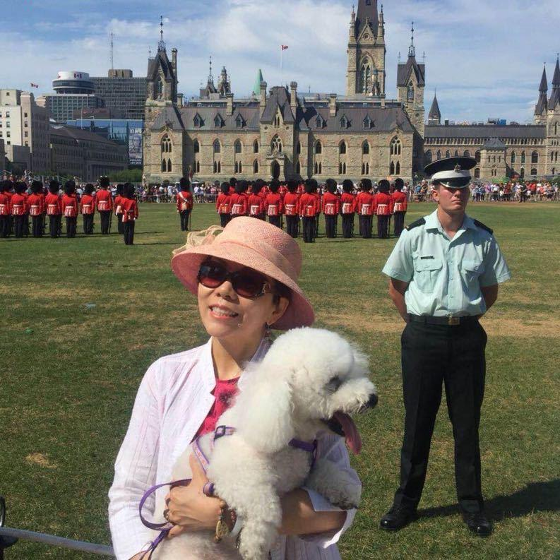

# Integrate AI models and Moviepy to Blender

## 1. Objectives

In chapter 09, we integrate AI models and Moviepy with Blender. 
Specifically, 

1. Replace Blender's video sequencer editor (VSE) with Moviepy.

   Because Moviepy is more pythonic and easier to use.  

2. Use AI models for compositing jobs.

   For the time being, we use the AI image/video models on the Alibaba Cloud Bailian platform.

&nbsp;
## 2. Moviepy

To make it easy to use Moviepy, we implement `movie/movie_editor.py` to provide following functions, 

1. video file to image sequence, and vice versa.

2. subclip to take a segment from a full-length video file.

3. concatenate a sequence of video files into one MP4 video file.

4. convert a colorful video file to be a black-and-white MP4 video file.

5. overlay subtitle text and image onto a video file.

   To write text to video, you need to download fonts.

   We download the English/Chinese font ttf files from https://fonts.google.com/noto/fonts

&nbsp;
## 3. Qwen AI model

### 3.1 Installation 

~~~
$ /home/robot/blender-4.4.3-linux-x64/4.4/python/bin/python3.11 -m pip install dashscope

$ /home/robot/blender-4.4.3-linux-x64/4.4/python/bin/python3.11 -m pip show dashscope
Name: dashscope
Version: 1.24.6
Summary: dashscope client sdk library
Home-page: https://dashscope.aliyun.com/
Author: Alibaba Cloud
Author-email: dashscope@alibabacloud.com
License: Apache 2.0
Location: /home/robot/blender-4.4.3-linux-x64/4.4/python/lib/python3.11/site-packages
Requires: aiohttp, certifi, cryptography, requests, websocket-client
Required-by:

$ /home/robot/blender-4.4.3-linux-x64/4.4/python/bin/python3.11 -m pip install asyncio

$ /home/robot/blender-4.4.3-linux-x64/4.4/python/bin/python3.11 -m pip show asyncio
Name: asyncio
Version: 4.0.0
Summary: Deprecated backport of asyncio; use the stdlib package instead
Home-page: 
Author: 
Author-email: 
License: 
Location: /home/robot/blender-4.4.3-linux-x64/4.4/python/lib/python3.11/site-packages
Requires: 
Required-by: 
~~~

### 3.2 Model and stability

There are quite some AI models for language, image, audio and video, 
on [Alibaba Bailian AI platform](https://help.aliyun.com/zh/model-studio/qwen-image-edit-api). 

For the time being, we only use the `qwen-image-edit` model for testing purpose. 

The biggest issue for us is the stability of the model. 
   
We ran the [`ai_gateway/qwen_remote.py`](./src/ai_gateway/qwen_remote.py) four times, 
with exactly the same script, within 10 minutes, to convert the following raw image to a green-screen image. 

   

     
   
  

Not as expected, the four generated image green-screen images are different. 

   

     
     &nbsp;
     
   
  

   

     
     &nbsp;
     
   
  

That means, even though the image model is powerful, 
however, due to its unstability, we cannot use the [`qwen-image-edit`](https://help.aliyun.com/zh/model-studio/qwen-image-edit-api) model 
to convert a video (consisting of a sequence of images) to a green-screen video. 

Instead, we should wait for a video model, that can convert a raw video to a green-screen one. 

&nbsp;
## 4. Software architecture

~~~
movie_blender_studio/

# System configuration
├── __init__.py
├── .env
├── dot.env -> .env
├── main.py
├── sys_config
│   ├── __init__.py
│   ├── import_in_blender.py
│   └── sys_config.env

# System tool
├── logger
│   ├── __init__.py
│   └── logger.py

# 'qwen' is just a beginning, we will add more AI models and functions here.
├── ai_gateway
│   ├── __init__.py
│   ├── __pycache__
│   └── qwen_remote.py

# 'animation' is one of the keys functionality of the entire system.
├── animation
│   ├── __init__.py
│   ├── animation.py
│   ├── constraint.py
│   └── keyframe.py

# 'camera' is one of the key functionality of the entire system.
# We will add 'light' 'layout' etc to mimick the functionality of a movie making team.  
├── camera
│   ├── __init__.py
│   ├── camera.py
│   ├── renderer.py 
│   └── renderer_opencv.py

# 'compositing' is one of the key functionality for post-production.
# It will integrate blender, opencv, ai-models together for compositing jobs.
├── compositing
│   ├── __init__.py
│   ├── cinematic_compositor.py
│   ├── color_compositor.py
│   ├── green_screen_compositor.py
│   ├── image_compositor.py
│   └── video_compositor.py

# 'tracking' is a popular job for post-production, video processing.
├── tracking
│   ├── __init__.py
│   └── camera_tracker.py

# superclass for blender's shader and other nodes. 
├── editor
│   ├── __init__.py
│   └── editor_node.py

# 'hdri' will be changed to 'environment'
├── hdri
│   ├── __init__.py
│   ├── dome_with_hdri_and_sun_generator.py
│   └── hdri_background.py

# 'model' will be changed to 'property', referring to single objects of movie-making property
├── model
│   ├── __init__.py
│   ├── water_generator.py
│   ├── riverbed_generator.py
│   ├── rock_generator.py
│   ├── utils
│   │   ├── __init__.py
│   │   └── curve_generator.py

# Tool to make the properties. 
├── material
│   ├── __init__.py
│   └── texture_shader.py

# Tool to make the properties. 
├── modifier
│   ├── __init__.py
│   └── modifier_generator.py

# 'scene' refers to the 'set' in movie production.
├── scene
│   ├── __init__.py
│   └── rocky_river_terrain.py

# Assemble the video clips into one final video.
├── movie
│   ├── __init__.py
│   └── movie_editor.py

# The Blender solution for video assembly is replaced by /movie.
└── video
    ├── __init__.py
    ├── video_channel.py
    ├── video_editor.py
    ├── audio_strip.py
    ├── image_sequence_strip.py
    ├── image_strip.py
    └── video_strip.py

~~~
