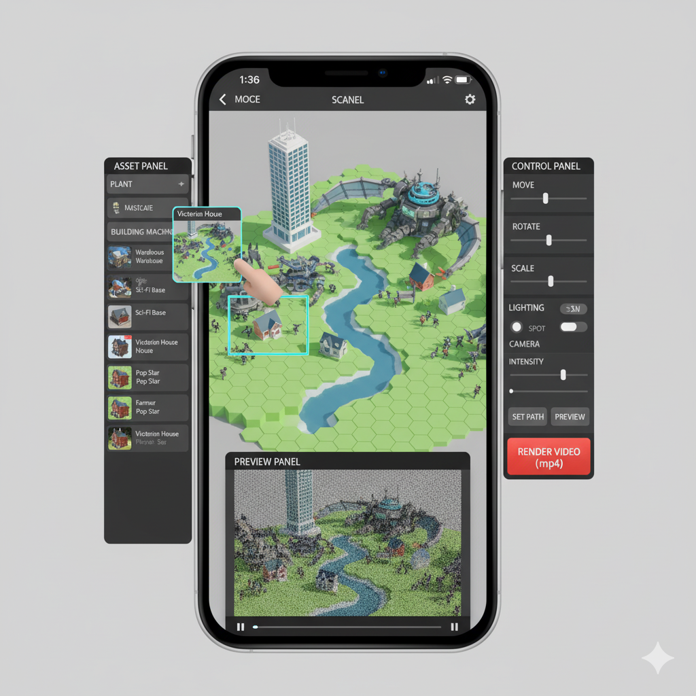
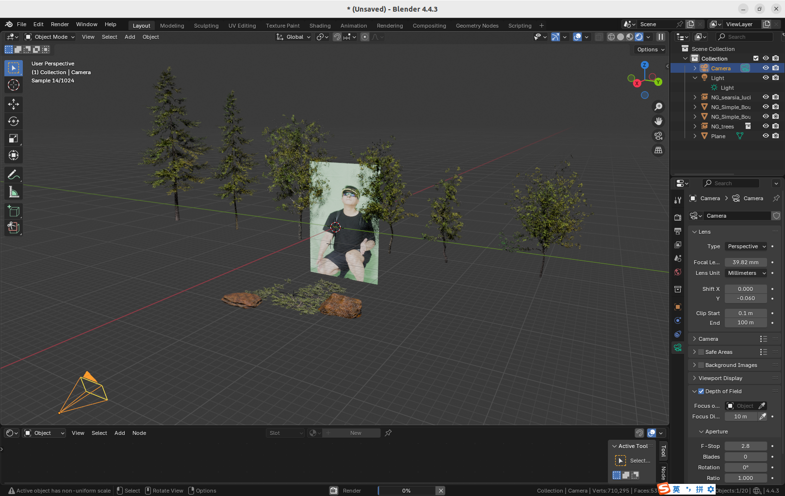
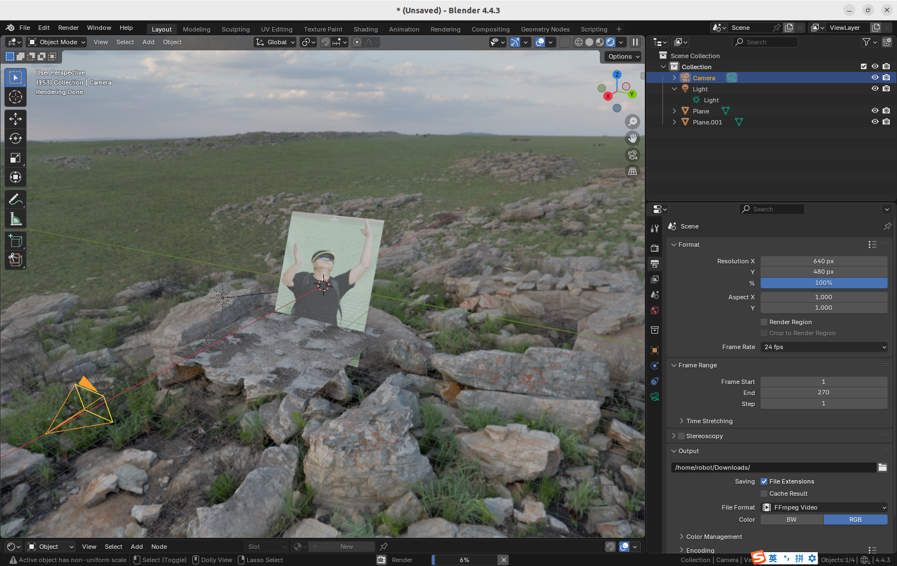

# A game for scene building and video making 

## 1. Objectives

So far we have made good progress in developing Blender python package. 

Not only does this package make Blender python programming much easier, 
but also it integrates OpenCV and AI models into Blender seamlessly. 

It is time to design the product and discuss the business model.

We propose to use this Blender python package to develop a game, 
a multiplayer cross-platform simulation/strategy game for scene building and video making. 

We use game's UI and business model to make scene-building and video-making easier and more fun. 

&nbsp;
## 2. Product design

### 2.1 Client side

The client-side application is developed in [Unity](https://unity.com/), 
primarily for its small app size and cross-platform compatibility across mobile phones and PCs.

The UI of the client side is similar to those city/empire building strategy games UI, 
e.g. "[Forge of empires](https://en-play.forgeofempires.com)", "[The Sims](https://www.ea.com/zh-cn/games/the-sims)". 

The game UI consists of the following parts，

1. Asset panel 

    The asset panel is for 3D asset objects, it consists of multiple categories, including "landscape", "building", "machine", "human", "animal", "plant" etc.

    Each category is a cascade-down menu, when expanding the menu, it will show the preview thumbnail of each 3D asset.

2. Scene panel

    The scene panel has the largest area. It is a 3D editing canvas.

    The player can drag and drop the 3D assets from the asset panel to the scene panel, i.e. the 3D editing canvas.
   
    The user can rotate the viewport of the 3D canvas, zoom in and out.

3. Control panel

    After the player clicks on one of the 3D object in the scene panel, he can move it, rotate it, scale it.

    Also, the player can set multiplelighting sources, change their orientation and strength, and plan the movement path of the camera. 
  
4. Preview panel

    After completing the scene building and the lighting setting and the camera movement planning, it is time to preview the video in the preview panel. 
  
    The quality of the preview video is of low-fidelity. The player can click the "rendering" button to remotely control the background GPU-empowered Blender cycles rendering engine, to generate high-fidelity .mp4 video.

   

     
   
 

We will use Unity to develop the client side game application. 
The game app acts as a digital stage manager, allowing the user to set up all the expressive data:

1. Scene Layout

    The list of all assets (e.g., Building_A, Actor_01), including their file references, position, rotation, and scale (Transform data).

2. Camera Path

    A series of keyframes defining the virtual camera's position, rotation, and lens settings (e.g., focal length, depth of field settings).

3. Lighting State

    The properties of every light source (type, color, intensity, shadows), which must match Blender's setup.

4. Greenscreen Projection

   Neither Blender nor Unity can effectively make mesh objects mimic a human actor's performance.
   
   In practice, we ask human actors to perform in front of a green screen, shoot video clips,
   and then project these clips onto transparent mesh planes.

5. Animation Events

   The specific animation clip to play for each actor and the timing/duration of that clip (e.g., Actor_01 plays Walk from frame 10 to 50).

6. Data Bridge

   The unity-based client app serializes the unity scene description, the lighting state and the animation paths, into a json file,
   and transmits the json file to the server side.

   Also, the data bridge receives the object mesh data, including their textures from the server side.

&nbsp;
### 2.2 Server side

The server side is a farm of headless (No graphical user interface) Blender instances.

The server receives the data from the client side, then executes our Blender python package to perform the following actions,

1. Data Parsing

   Read the incoming JSON payload from the unity-based client side.

2. Asset Retrieval

   Following the client side scene description, find the related 3D mesh objects from the asset database that we maintain.

   While the mesh objects on the client side are always in low-polygon mode,
   their counterparts on the server side may be in high-polygon mode,
   to generate video clip with better quality.

3. Asset Database

   The database stores the .gltf and .fbx files of the pre-created 3D objects, as well as their texture images.

   For each 3D object, the database uses the `Decimate Modifier` to create multiple versions,
   in low-polygon, medium-poly, and high-poly modes.

   The database calculates the difference in surface orientation (the normals)
   between the high-poly mesh and the low-poly mesh, and saves the diretional information into a `normal map` texture image.

   Since mobile phones prefer one single texture file (atlas) rather than multiple materials on one object, 
   the database bakes the multiple texture images into one singel texture file (atlas) for each 3D object.

4. Scene Construction

   Using our Blender python package to iterate through the json data from the client side,
   and construct the symmetrical scene on the server side. 

   Recreate the camera path, i.e. the camera animation keyframes.

   Configure all light sources on the Blender server side, to match the light setting on the Unity client side.

5. Greenscreen Projection

   Neither Blender nor Unity can effectively make mesh objects mimic a human actor's performance.
   
   In practice, we ask human actors to perform in front of a green screen, shoot video clips,
   and then project these clips onto transparent mesh planes.

   The Unity client defines these projection settings,
   the Blender server replicates the projection to place the actors 'inside' the virtual environment.

6. Animation Events

   The Unity client defines the animation events, including the movement of the camera, and the changes of the lighting.
   The Blender server replicates these animation event. 

7. Video rendering

   The server side Blender executes the Cycles rendering engine to generate the sequence of frame images,
   and then stitch these frames into the final .mp4 video.

   Once the .mp4 video is generated, the server side delivers the .mp4 file back to the client.

   

     
     &nbsp;
     
   
  
   
