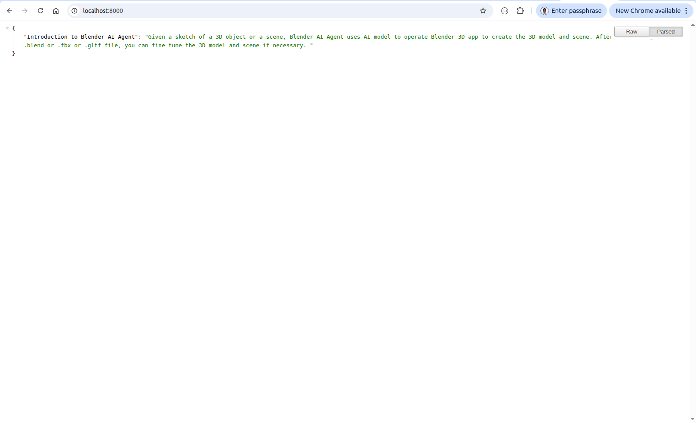

# Blender AI Agent

## 1. Objectives

### 1.1 Mission

Anthropic's Claude is an AI agent that is capable of writing programs. 

Blender AI agent is capable of operating Blender app, to build 3D models and construct 3D scenes.

The game industry hires many artists and engineers, to build 3D models and construct 3D scenes manually, 
including human, monsters, weapons, buildings, city streets, and landscape etc. 

This manual job costs expensive human labor, and takes long time. 

Similarly, the movie making industry hires many artists and engineers, to build 3D models and construct 3D scenes, 
for visual special effects (VFX), like explosion, collision, earthquake, tsunami etc. 

Blender AI agent consists of AI models that are custom trained to operate Blender as well as other 3D apps,
in addition to task-specific AI agents that are designed to perform 3D object generation. 

The mission of Blender AI agent is to greatly reduce the human labor and time cost to generate 3D objects, 
while keeps the accuracy and details of hand-made craftwork. 

### 1.2 Workflow

Anthropic Claude's workflow is composed of the following sequential steps:

1. analyze customer's requirements,
2. design system architecture,
3. decompose tasks,
4. implement the system,
5. test and fix bugs,
6. write delivery documentation
 
Given a text prompt and optionally a 2D sketch, Blender AI agent follows the similar workflow, 
to operate Blender 3D, so as to generate the 3D models and scenes.

Also similar to Anthropic, we use multi-agents to do this job. 

1. The `Lead Agent` acts as the project manager and system architect. Its job is primarily strategic, organizational, and quality assurance.
   It is the entity responsible for the successful end-to-end delivery.

2. The `Sub Agents` are specialized workers responsible for execution.
   Their job is primarily tactical and focused on producing high-quality output for a specific, narrow task defined by the Lead Agent.

&nbsp;
# 2. Run the client and server

## 2.1. the Fastapi backend engine.

1. Startup the fastapi backend server.
   
~~~
$ pwd
  /home/robot/langchain_20251209/server

$  bash startup.sh 
  [INFO] startup.sh is starting up the Blender AI Agent server.
~~~

2. Shutdown

~~~
$ pwd
  /home/robot/langchain_20251209/server

$ bash shutdown.sh 
  shutdown.sh is shuting down the Blender AI agent ... 
  Terminate: 
  2436454 python3 langchain/blender_agent_server.py
  PGID: 2436452, PID: 2436454
~~~

3. Webpage
   
Open a browser, and visit: `http://localhost:8000/`, 
to verify if the fastapi backend server works well.

   

     
   
  
   

## 2.2. the VUE frontpage server

We used VUE3 to create the front tier webpages, implementing a chatbot that is similar to [Google gemini app](https://gemini.google.com/app)

To setup the front tier, please read [Chatbot vue3 webpage](./src/client/chatbot_vue3.md)

1. Startup the vue frontpage server
   
~~~
$ pwd
  /home/robot/langchain_20251209/client/gemini_clone_20251210
$ npm --version
  11.6.2

$ npm run dev
  VITE v7.2.7  ready in 127 ms
  ➜  Local:   http://localhost:5173/
  ➜  Network: use --host to expose
  ➜  press h + enter to show help
~~~

2. Shutdown

~~~
Ctrl-c
~~~

3. Webpage
   
Open a browser, and visit: `http://localhost:5173/`,
to verify if the vue frontpage server works well.

   

     
   
  
