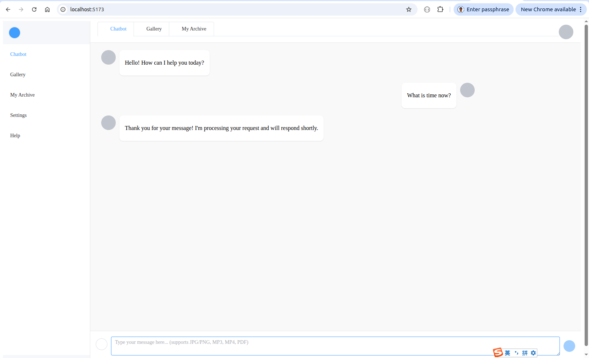

# Chatbot vue3 webpage 

## 1. Objective

The webpage mimicks the gemini chatbot, using VUE3. 

The code was generated by doubao. 

&nbsp;
## 2. Project Setup

First, create a new Vue 3 project and install dependencies:

~~~
$ pwd
  /home/robot/langchain_20251209/client
$ npm create vite@latest gemini_clone_20251210 -- --template vue

$ cd gemini_clone_20251210
$ npm install
$ npm install element-plus @element-plus/icons-vue axios
$ npm install vue-router@4

$ npm run dev
~~~

&nbsp;
## 3. File structure

~~~
$ pwd
  /home/robot/langchain_20251209/client/gemini_clone_20251213

$ tree .
.
├── node_modules
│   └── ...
├── index.html
├── package.json
├── package-lock.json
├── public
│   └── vite.svg   // Useless
├── src
│   ├── App.vue
│   ├── assets
│   │   ├── icons
│   │   │   ├── archive.svg
│   │   │   ├── chatbot.svg
│   │   │   ├── delete.svg
│   │   │   ├── download.svg
│   │   │   ├── edit.svg
│   │   │   ├── file.svg
│   │   │   ├── gallery.svg
│   │   │   ├── help.svg
│   │   │   ├── menu.svg
│   │   │   ├── monitoring.svg
│   │   │   ├── plus.svg
│   │   │   ├── robot.svg
│   │   │   ├── search.svg
│   │   │   ├── send.svg
│   │   │   ├── settings.svg
│   │   │   ├── upload.svg
│   │   │   └── user.svg
│   │   └── vue.svg    // Useless
│   ├── components
│   │   ├── archive
│   │   │   └── ArchivePanel.vue
│   │   ├── auth
│   │   │   └── LoginModal.vue
│   │   ├── chat
│   │   │   ├── ChatInput.vue
│   │   │   ├── ChatMessages.vue
│   │   │   ├── ChatPanel.vue
│   │   │   └── MessageItem.vue
│   │   ├── gallery
│   │   │   └── GalleryPanel.vue
│   │   └── layout
│   │       ├── Sidebar.vue
│   │       └── TopBar.vue
│   ├── composables
│   │   ├── useChatStore.js
│   │   ├── useFileHelpers.js
│   │   └── useWebSocket.js
│   ├── main.js
│   └── style.css
└── vite.config.js

11 directories, 38 files

~~~

&nbsp;
## 4. Running the App

~~~
$ pwd
  /home/robot/langchain_20251209/client/gemini_clone_20251210
$ npm --version
  11.6.2

$ npm run dev
  VITE v7.2.7  ready in 127 ms

  ➜  Local:   http://localhost:5173/
  ➜  Network: use --host to expose
  ➜  press h + enter to show help
~~~

Open the chrome browser and visit http://localhost:5173/

You will see the webpage as the following screenshot, 

   

     
   
  
