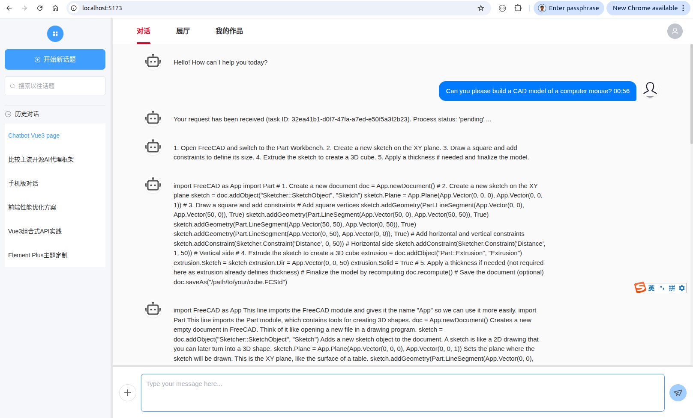
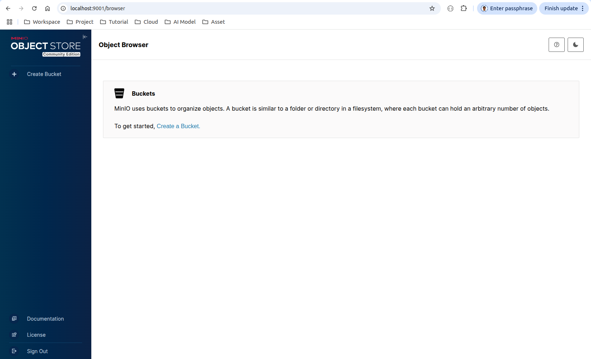

# End-to-end agent instructure

## 1. Objectives

We implemented an end-to-end agent infrastructure, including the following components. 

1. Web pages: A web-socket based chatbot webpage, to enable a human user to chat with our agents.

   The front tier also includes a gallery webpage to display the works that were generated by human users using our agents. 

2. Web engine: Use FastAPI/Uvicorn to implement a HTTP engine.

   And in the recent future, we will use FastAPI/user to implement the authentication. 

3. Messaging queue: Use Rabbit-mq to implement a messaging queue so as to the keep the entire backend system loosely-decoupled.

4. Taks dispatching: On top of Rabbit-mq, we use celery to implement the task submission and dispatching mechanism.

5. Agent group: Use Langchain to implement AI agents that call the remote AI models like Qwen coder.

   In addition, we organize the agents into orchestrator agent and sub-agents, and use a graph-based state mechine for the workflow.

6. Headless CAD processor: As a demo, we run FreeCAD app in a headless mode to generate CAD 3D objects.

7. Vector database: Use Postgre-sql's pgvector to implement the vector database for the knowledge base.

8. Chat history: Use Progre-sql database to store the chat history between human users and our agents.

9. Object storage: Use Min-io to implement a S3-like object storage to store files and other contents in object mode.

10. Standalone system: Use Linux system daemon service, to convert the FastAPI web engine, Rabbit-mq, Celery, LangChain agent, Postgre-sql & pgvector, MinIO storage into standalone services. 

&nbsp;
## 2. Usage 

1. In a ubuntu terminal, starts up the system daemon service,

   ~~~
   $ pwd
     /home/robot/aiBlender/aiBlender_20251218/server

   ~~~

   

&nbsp;
## 3. Install postgre-sql and pgvector

[PostgreSQL's office website](https://www.postgresql.org/docs/14/admin.html) 
provides details installation and administration guide.

To do it quickly, you can follow our steps to install postgre-sql, and start it up as a ubuntu system service. 

### 3.1 Install postgre-sql
~~~
Step 1: Update System Packages
$ sudo apt update
$ sudo apt upgrade -y

Step 2: Install PostgreSQL
$ sudo apt install postgresql postgresql-contrib -y

# Verify Installation
$ sudo systemctl status postgresql

Step 3: Basic Post-Install Configuration
  # 1. Switch to the postgres User
  $ sudo -i -u postgres

  # 2. Set a Password for the postgres DB User
    Run the PostgreSQL CLI (psql):
  postgres$ psql

    Following are inside psql shell:
  postgres=# ALTER USER postgres WITH PASSWORD '1234567890';
  postgres=# \q

  # 3. Create a new user (for testing purpose)
  postgres$ createuser --interactive --pwprompt robot
    Enter password for new role: 1234567890   
    Enter it again: 1234567890
    Shall the new role be a superuser? (y/n) y

  # 4. Create a new database (for testing purpose)
  postgres$ createdb --owner=robot robot_db  (Doesn't work)
  postgres$ CREATE DATABASE robot_db OWNER robot (Doesn't work)
  postgres$ exit

  $ sudo -i -u postgres createdb --owner=robot robot_db  (This one works)
~~~

&nbsp;
### 3.2 Configure networking

**Step 1. Edit the pg_hba.conf file**

1. Check the version of our postgre-sql 
   ~~~
   $ ls /etc/postgresql/
     14
   ~~~

2. Edit the pg_hba.conf file, replace `<VERSION>` as `14`
   ~~~
   $ sudo vim /etc/postgresql/<VERSION>/main/pg_hba.conf
   ~~~

   Find the lines for local and host connections, and update to use `md5` for password authentication):
   ~~~
   # Local connections
   local      all      all                        md5
   # IPv4 local connections
   host       all      all      127.0.0.1/32      md5
   # IPv6 local connections
   host       all      all      ::1/128           md5
   ~~~

3. Add this line to allow access from your local network (replace 192.168.1.0/24 with your subnet):
   ~~~
   host       all      all     192.168.1.0/24     md5
   ~~~

**Step 2. Edit postgresql.conf to listen for connections**
   ~~~
   $ sudo vim /etc/postgresql/<VERSION>/main/postgresql.conf
   ~~~

   Update the `listen_addresses` line to allow all interfaces:
   ~~~
   listen_addresses = '*'             # Default is 'localhost'
   ~~~

**Step 3. Restart PostgreSQL to apply changes**
   ~~~
   $ sudo systemctl status postgresql
     ● postgresql.service - PostgreSQL RDBMS
         Loaded: loaded (/lib/systemd/system/postgresql.service; enabled; vendor preset: enabled)
         Active: active (exited) since Tue 2025-12-23 21:09:07 CST; 30min ago
        Process: 3940105 ExecStart=/bin/true (code=exited, status=0/SUCCESS)
       Main PID: 3940105 (code=exited, status=0/SUCCESS)
            CPU: 805us 
     Dec 23 21:09:07 robot-test systemd[1]: Starting PostgreSQL RDBMS...
     Dec 23 21:09:07 robot-test systemd[1]: Finished PostgreSQL RDBMS

   $ sudo systemctl restart postgresql
   $
   ~~~

&nbsp;
### 3.3 Install pgvector

**Step 1. Add the pgvector repository**

   ~~~
   # Add PG apt repo (if not already added)
   $ sudo sh -c 'echo "deb http://apt.postgresql.org/pub/repos/apt $(lsb_release -cs)-pgdg main" > /etc/apt/sources.list.d/pgdg.list'
   $ wget --quiet -O - https://www.postgresql.org/media/keys/ACCC4CF8.asc | sudo apt-key add -
   # sudo apt update
    
   # Install pgvector, replace <VERSION> with 14
   # sudo apt install postgresql-<VERSION>-pgvector -y
   ~~~

&nbsp;
**Step 2. Enable pgvector in the postgre-sql database**

1. Connect to the postgre-sql database and enable the extension
   ~~~
   $ psql -U robot -d robot_db -h localhost
     Password for user robot: 1234567890
     psql (14.20 (Ubuntu 14.20-0ubuntu0.22.04.1))
     SSL connection (protocol: TLSv1.3, cipher: TLS_AES_256_GCM_SHA384, bits: 256, compression: off)
     Type "help" for help.

   robot_db=# 
   ~~~

2. Run this SQL command, and verify
   ~~~
   robot_db=# CREATE EXTENSION IF NOT EXISTS vector;

   robot_db=# \dx     # Verify that "vector" column does exist.
                             List of installed extensions
        Name   | Version |   Schema   |                     Description                      
      ---------+---------+------------+------------------------------------------------------
       plpgsql | 1.0     | pg_catalog | PL/pgSQL procedural language
       vector  | 0.8.1   | public     | vector data type and ivfflat and hnsw access methods
      (2 rows)

   robot_db=# \q
   ~~~

&nbsp;
### 3.4 Uninstall postgre-sql and pgvector completely
~~~
$ sudo apt purge postgresql postgresql-contrib -y

$ sudo apt autoremove -y

# Delete data directories (CAUTION: irreversibly deletes all databases!)
$ sudo rm -rf /var/lib/postgresql/
~~~

&nbsp;
### 3.5 Status, starup, shutdown, and reload/restart
~~~
# 1. Check PostgreSQL Service Status
$ sudo systemctl status postgresql
  ● postgresql.service - PostgreSQL RDBMS
       Loaded: loaded (/lib/systemd/system/postgresql.service; enabled; vendor preset: enabled)
       Active: active (exited) since Tue 2025-12-23 19:00:00 UTC; 10min ago
     Main PID: 1234 (code=exited, status=0/SUCCESS)
          CPU: 10ms

# 2. Start PostgreSQL Service
$ sudo systemctl start postgresql

# 3. Shutdown PostgreSQL Service
$ sudo systemctl stop postgresql

# 4. Restart PostgreSQL Service, or Reload it without downtime
$ sudo systemctl restart postgresql
$ sudo systemctl reload postgresql
~~~

&nbsp;
### 3.6 Manage postgre-sql and pgvector via langchain

Refer to our source code [`postgre_client.py`](./src/server/postgre_sql/postgre_client.py).

To run its `usage_demo()`, 
~~~
$ pwd
  /home/robot/aiBlender/aiBlender_20251218/server

$ python3 postgre_sql/postgre_client.py 
~~~

&nbsp;
## 4. Install min_io file system

[MioIO's github repo](https://github.com/minio/minio) 
provides the link to min_io's document, including installation and administration guide.

To do it quickly, you can follow our steps to install min_io, and start it up as a ubuntu system service. 

### 4.1 Install min_io

**Step 1. Download min_io binary file**
~~~
$ sudo apt update
$ sudo apt upgrade -y

# Download min_io binary
$ wget https://dl.min.io/server/minio/release/linux-amd64/minio -O /tmp/minio

# Grant executable permission
$ echo $USER
  robot

$ chmod +x /tmp/minio
$ ls -l /tmp/minio
  -rwxrwxr-x 1 robot robot 110989496 Sep  8 01:54 minio
~~~

**Step 2. Install min_io**

Before installation, the system cannot find the executable file, 
~~~
$ which minio     
$  
~~~

After installation, that is simply moving the executable binary file to /usr/local/bin,
the system can find the executable file now.
~~~
# The installation is simply moving the executable binary file to /usr/local/bin.
$ sudo mv /tmp/minio /usr/local/bin/

$ which minio    
  /usr/local/bin/minio

# Verify the installation (check the version to confirm success)
$ minio --version
  minio version RELEASE.2025-09-07T16-13-09Z (commit-id=07c3a429bfed433e49018cb0f78a52145d4bedeb)
  Runtime: go1.24.6 linux/amd64
  License: GNU AGPLv3 - https://www.gnu.org/licenses/agpl-3.0.html
  Copyright: 2015-2025 MinIO, Inc.
~~~

&nbsp;
### 4.2 Configure min_io service

**Step 1. Prepare the min_io data storage directory**
~~~
$ echo $USER
  robot

# Create data directory
$ sudo mkdir -p /mnt/minio/data

# Set appropriate permissions (use current user to run MinIO to avoid permission issues)
$ sudo chown -R $USER:$USER /mnt/minio/data

$ tree /mnt
  /mnt
  └── minio
     └── data
~~~

**Step 2. Create min_io service configuration file**
~~~
$ echo $USER
  robot

$ sudo vim /etc/systemd/system/minio.service
~~~

Here is the full content of [`minio.service`](./src/server/config/minio/minio.service),

~~~
[Unit]
Description=MinIO Object Storage
Documentation=https://docs.min.io
Wants=network-online.target
After=network-online.target

[Service]
Type=simple
User=robot
Group=robot
ExecStart=/usr/local/bin/minio server /mnt/minio/data --console-address ":9001"
Restart=always
RestartSec=5
Environment="MINIO_ROOT_USER=robot"
Environment="MINIO_ROOT_PASSWORD=R***t@1**"  

[Install]
WantedBy=multi-user.target
~~~

Notice that, 
* The `robot` in the file is your user name in Ubuntu, `R***t@1**` is your password.

&nbsp;
### 4.3 Status, starup, shutdown, and reload/restart
~~~
# 1. Check min_io status, the current status is 'inactive (dead)'
$ sudo systemctl status minio
○ minio.service - MinIO Object Storage
     Loaded: loaded (/etc/systemd/system/minio.service; disabled; vendor preset: enabled)
     Active: inactive (dead)
       Docs: https://docs.min.io

Dec 27 15:36:23 robot-test minio[59157]: License: GNU AGPLv3 - https://www.gnu.org/licenses/agpl-3.0.html
Dec 27 15:36:23 robot-test minio[59157]: Version: RELEASE.2025-09-07T16-13-09Z (go1.24.6 linux/amd64)
Dec 27 15:36:23 robot-test minio[59157]: API: http://192.168.0.129:9000  http://172.17.0.1:9000  http://127.0.0.1:9000
Dec 27 15:36:23 robot-test minio[59157]: WebUI: http://192.168.0.129:9001 http://172.17.0.1:9001 http://127.0.0.1:9001
Dec 27 15:36:23 robot-test minio[59157]: Docs: https://docs.min.io
Dec 27 16:37:58 robot-test systemd[1]: Stopping MinIO Object Storage...
Dec 27 16:37:58 robot-test minio[59157]: INFO: Exiting on signal: TERMINATED
Dec 27 16:37:58 robot-test systemd[1]: minio.service: Deactivated successfully.
Dec 27 16:37:58 robot-test systemd[1]: Stopped MinIO Object Storage.
Dec 27 16:37:58 robot-test systemd[1]: minio.service: Consumed 4.214s CPU time.

# 2. Start min_io service
$ sudo systemctl start minio
$

# The current status is 'active (running)'
$ sudo systemctl status minio
● minio.service - MinIO Object Storage
     Loaded: loaded (/etc/systemd/system/minio.service; disabled; vendor preset: enabled)
     Active: active (running) since Sat 2025-12-27 16:38:59 CST; 1min 6s ago
       Docs: https://docs.min.io
   Main PID: 123159 (minio)
      Tasks: 25 (limit: 38031)
     Memory: 70.7M
        CPU: 396ms
     CGroup: /system.slice/minio.service
             └─123159 /usr/local/bin/minio server /mnt/minio/data --console-address :9001

Dec 27 16:38:59 robot-test systemd[1]: Started MinIO Object Storage.
Dec 27 16:39:00 robot-test minio[123159]: MinIO Object Storage Server
Dec 27 16:39:00 robot-test minio[123159]: Copyright: 2015-2025 MinIO, Inc.
Dec 27 16:39:00 robot-test minio[123159]: License: GNU AGPLv3 - https://www.gnu.org/licenses/agpl-3.0.html
Dec 27 16:39:00 robot-test minio[123159]: Version: RELEASE.2025-09-07T16-13-09Z (go1.24.6 linux/amd64)
Dec 27 16:39:00 robot-test minio[123159]: API: http://192.168.0.129:9000  http://172.17.0.1:9000  http://127.0.0.1:9000
Dec 27 16:39:00 robot-test minio[123159]: WebUI: http://192.168.0.129:9001 http://172.17.0.1:9001 http://127.0.0.1:9001
Dec 27 16:39:00 robot-test minio[123159]: Docs: https://docs.min.io

# 3. Shutdown min_io service
$ sudo systemctl stop minio
$ 

# 4. Restart min_io service Service, or Reload it without downtime
$ sudo systemctl restart min_io
$ 

# The systemctl reload command is designed for services that support hot reloading (e.g., Nginx, Apache, SSHD)
# min_io doesn't support hot reloading.
$ sudo systemctl reload minio
  Failed to reload minio.service: Job type reload is not applicable for unit minio.service.
~~~

&nbsp;
### 4.4 Admin webpage

Open a browser, and visit `http://localhost:9001`.

The login name and password is the same as you login to the ubuntu OS.  

&nbsp;
## 5. Convert Fastapi web server into a system service

Previously, we started up the fastapi web server and shut it down in the following ways. 

1. Start up fastapi web server, referring to [`startup.sh`](../chapter_11/src/server/startup.sh),
   ~~~
   PYTHONPATH="${PYTHONPATH}:${PWD}"
   export PYTHONPATH 
   mkdir -p logs
   nohup python3 fastapi_server/fastapi_engine.py > logs/fastapi_engine_log.txt 2>&1 &
   ~~~

2. Shut down fasapi web server, referring to [`shutdown.sh`](../chapter_11/src/server/shutdown.sh),
   ~~~
   PYTHONPATH="${PYTHONPATH}:${PWD}"
   export PYTHONPATH 

   # Reference: Is there a way to kill uvicorn cleanly?
   # https://stackoverflow.com/questions/60424390/is-there-a-way-to-kill-uvicorn-cleanly
   SERVER_PID="$(pgrep -f 'fastapi_engine')"

   echo
   echo "[INFO] Terminate fastapi_engine: " 
   echo $(ps -p $SERVER_PID -f -o pid -o command | tail -n +2)

   if [[ -n "$SERVER_PID" ]]
   then
       # PGID="$(ps --no-headers -p $PID -o pgid)"
       PGID="$(ps -p $SERVER_PID -o pgid | tail -n +2)"
       echo "    PGID: $PGID, PID: $SERVER_PID"
       echo 
       # kill -SIGINT -- -${PGID// /}
       kill -SIGKILL -- ${SERVER_PID// /}
   fi
   ~~~

To be convenient, we convert the fast web server into a system service. 

&nbsp;
### 5.1 Configure fastapi service

1. Create a file name `fastapi-webserver.service`,
   ~~~
   $ mkdir -p /home/robot/aiBlender/aiBlender_20251218/server/config/fastapi
   $ cd /home/robot/aiBlender/aiBlender_20251218/server/config/fastapi

   $ touch fastapi-webserver.service
   $ sudo chmod 755 fastapi-webserver.service
   ~~~

2. Store the following content into `fastapi-webserver.service`,
   ~~~
   [Unit]
   Description=FastAPI Service 
   After=network.target
   Requires=network.target
   Documentation=man:python3(1)

   [Service]
   User=robot
   Group=robot
   WorkingDirectory=/home/robot/aiBlender/aiBlender_20251218/server  
   ExecStart=/home/robot/miniconda3/envs/tripoSG/bin/python3 fastapi_server/fastapi_engine.py

   # Keep ONLY critical logging env var  
   Environment="PYTHONPATH=/home/robot/aiBlender/aiBlender_20251218/server"
   Environment="PYTHONUNBUFFERED=1"

   # Reliability settings
   Restart=always
   RestartSec=5
   TimeoutStartSec=30
   TimeoutStopSec=10

   # Logging
   StandardOutput=journal+console
   StandardError=journal+console

   [Install]
   WantedBy=multi-user.target
   ~~~

   Notice that,
   * `Environment="PYTHONPATH=...`:
     This enables to run `python3 fastapi_server/fastapi_engine.py` in the working directory.
     
   * `Environment="PYTHONUNBUFFERED=1"`:
     This stores the log immediately to the journal log file, instead of in the buffer.
     
   * `ExecStart=/home/robot/miniconda3/envs/tripoSG/bin/python3`:
     This makes the python3 run in the `tripoSG` conda virtual environment.

3. Copy the service file to system daemon directory,
   ~~~
   $ sudo cp fastapi-webserver.service /etc/systemd/system/.
   
   $ sudo chmod 755 /etc/systemd/system/fastapi-webserver.service
   ~~~

4. Reload systemd to detect the updated service file,
   ~~~
   $ sudo systemctl daemon-reload
   ~~~

&nbsp;
### 5.2 Status, starup, and shutdown

~~~
# 1. Check fastapi web server's status, the current status is 'inactive (dead)'
$ $ sudo systemctl status fastapi-webserver
○ fastapi-webserver.service - FastAPI Service
     Loaded: loaded (/etc/systemd/system/fastapi-webserver.service; disabled; vendor preset: enabled)
     Active: inactive (dead)
       Docs: man:python3(1)

Dec 28 20:51:35 robot-test python3[1216279]: INFO:     Uvicorn running on http://0.0.0.0:8000 (Press CTRL+C to quit)
Dec 28 20:51:53 robot-test python3[1216279]: INFO:     127.0.0.1:51854 - "GET / HTTP/1.1" 200 OK
Dec 28 21:29:02 robot-test systemd[1]: Stopping FastAPI Service...
Dec 28 21:29:02 robot-test python3[1216279]: INFO:     Shutting down
Dec 28 21:29:02 robot-test python3[1216279]: INFO:     Waiting for application shutdown.
Dec 28 21:29:02 robot-test python3[1216279]: INFO:     Application shutdown complete.
Dec 28 21:29:02 robot-test python3[1216279]: INFO:     Finished server process [1216279]
Dec 28 21:29:02 robot-test systemd[1]: fastapi-webserver.service: Deactivated successfully.
Dec 28 21:29:02 robot-test systemd[1]: Stopped FastAPI Service.
Dec 28 21:29:02 robot-test systemd[1]: fastapi-webserver.service: Consumed 2.944s CPU time.

# 2. Start fastapi web serve's service
$ sudo systemctl start fastapi-webserver
$

# The current status is 'active (running)'
$ sudo systemctl status fastapi-webserver
● fastapi-webserver.service - FastAPI Service
     Loaded: loaded (/etc/systemd/system/fastapi-webserver.service; disabled; vendor preset: enabled)
     Active: active (running) since Sun 2025-12-28 21:30:08 CST; 20s ago
       Docs: man:python3(1)
   Main PID: 1255136 (python3)
      Tasks: 6 (limit: 38031)
     Memory: 39.7M
        CPU: 327ms
     CGroup: /system.slice/fastapi-webserver.service
             └─1255136 /home/robot/miniconda3/envs/tripoSG/bin/python3 fastapi_server/fastapi_engine.py

Dec 28 21:30:08 robot-test python3[1255136]: 2025-12-28 21:30:08 - rabbit_mq [DEBUG] RabbitMQConnection(), RabbitMQConnection initialized successfully. (rabbitmq_service.py:38)
Dec 28 21:30:08 robot-test python3[1255136]: 2025-12-28 21:30:08 - rabbit_mq [DEBUG] RabbitMQService(), RabbitMQService 'fastapi_server' initialized successfully. (rabbitmq_serv>
Dec 28 21:30:08 robot-test python3[1255136]: 2025-12-28 21:30:08 - rabbit_mq [DEBUG] RabbitMQService(), RabbitMQService 'fastapi_server' initialized successfully. (rabbitmq_serv>
Dec 28 21:30:08 robot-test python3[1255136]: 2025-12-28 21:30:08 - fastapi_server [WARNING] BlenderAgentServer(), cannot load the configuration file, the error message is: 'expe>
Dec 28 21:30:08 robot-test python3[1255136]: 2025-12-28 21:30:08 - fastapi_server [INFO] startup(), Fastapi server is starting up (PID=1255136) ...
Dec 28 21:30:08 robot-test python3[1255136]:  (fastapi_engine.py:110)
Dec 28 21:30:08 robot-test python3[1255136]: INFO:     Started server process [1255136]
Dec 28 21:30:08 robot-test python3[1255136]: INFO:     Waiting for application startup.
Dec 28 21:30:08 robot-test python3[1255136]: INFO:     Application startup complete.
Dec 28 21:30:08 robot-test python3[1255136]: INFO:     Uvicorn running on http://0.0.0.0:8000 (Press CTRL+C to quit)

# 3. Shutdown fastapi web serve's service
$ sudo systemctl stop fastapi-webserver
$ 
~~~

&nbsp;
### 5.3 View and delete the journal log

1. View the journal log
~~~
$ sudo journalctl -u fastapi-webserver -n 100
~~~

2. Delete the journal log
~~~
# Step 1: Stop the Service (Prevent Log Writing During Cleanup)
$ sudo systemctl stop fastapi-webserver

# Step 2: Rotate the Journal (Isolate Old Logs)
# Create a new journal file to separate old logs from new ones (critical for targeted cleanup):
$ sudo journalctl --rotate

# Step 3: Invalidate Old Logs for the Service
# Mark old logs for deletion (this tells journald to ignore logs for fastapi-webserver before the rotation):
$ sudo journalctl --vacuum-time=1s -u fastapi-webserver

# Step 4: Restart Services (Refresh Logs)
# Restart journald to apply changes
$ sudo systemctl restart systemd-journald

# Restart your FastAPI service (starts writing fresh logs)
$ sudo systemctl start fastapi-webserver
~~~

Notice that, if you want to quickly delete the previous journal log, you can simply do step 3. 
~~~
# Step 3: Invalidate Old Logs for the Service
# Mark old logs for deletion (this tells journald to ignore logs for fastapi-webserver before the rotation):
$ sudo journalctl --vacuum-time=1s -u fastapi-webserver
~~~
* --vacuum-time=1s: Keep only logs from the last 1 second (effectively deletes all old logs for the service).
* -u fastapi-webserver: Restrict cleanup to only this service (key to avoiding accidental deletion of other logs).

&nbsp;
### 5.4 Fastapi webpage

Open a browser, and visit `http://localhost:8000/`.

&nbsp;
## 6. Convert Langchain agent system into a system service

The method is similar to ["5. Convert Fastapi web server into a system service"](./aiBlender_end_to_end.md#5-convert-fastapi-web-server-into-a-system-service)

Here is the full content of [`langchain-agent.service`](./src/server/config/langchain/langchain-agent.service).

