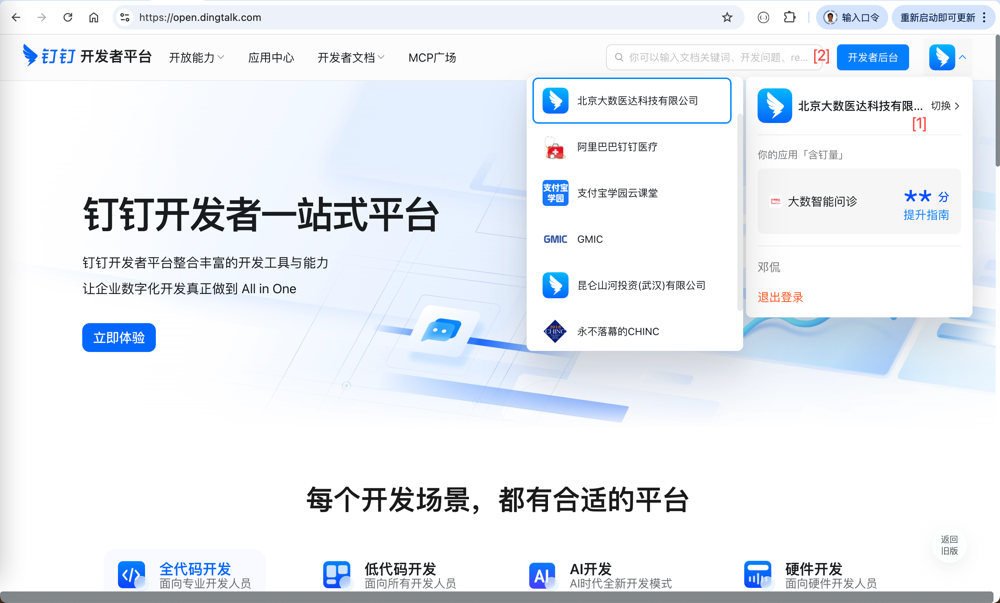
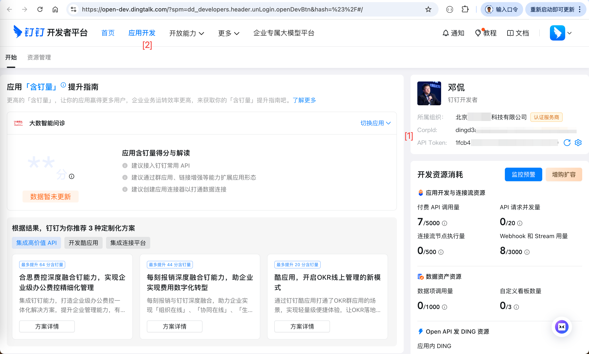
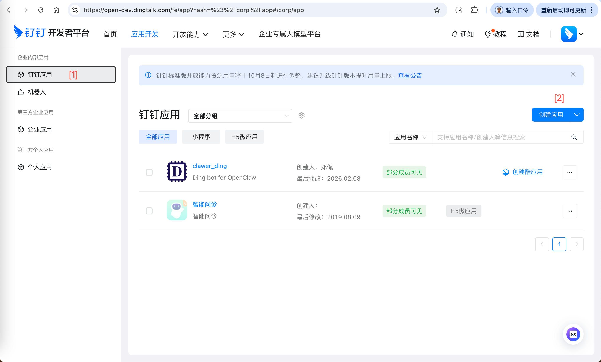
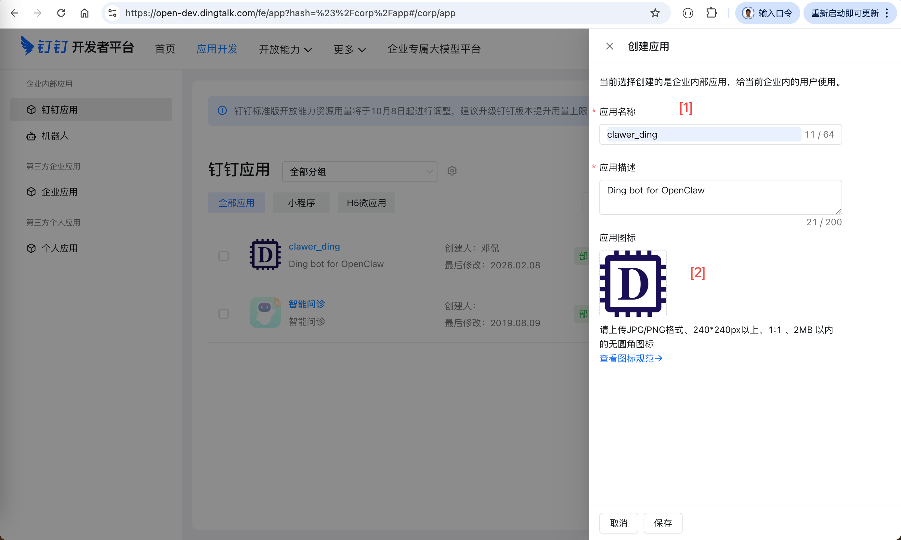
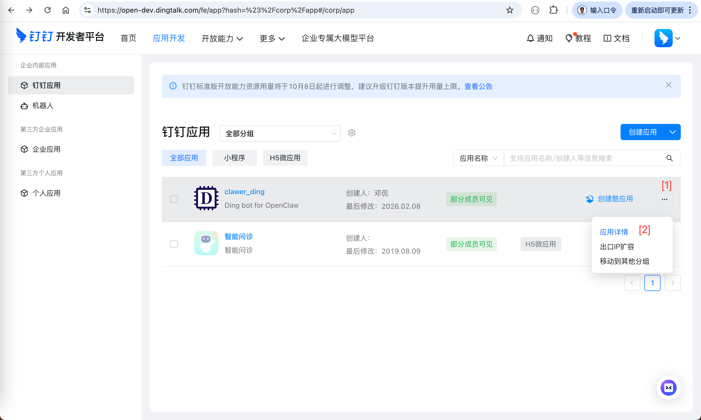
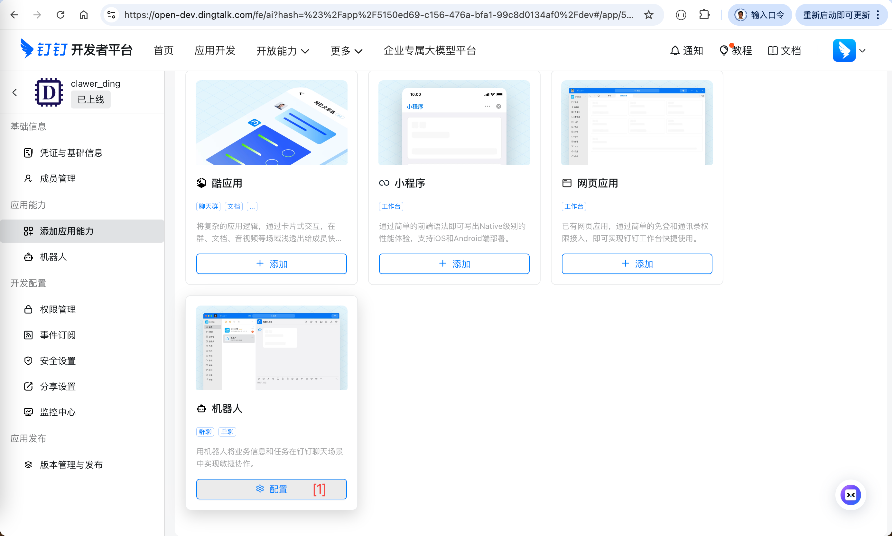
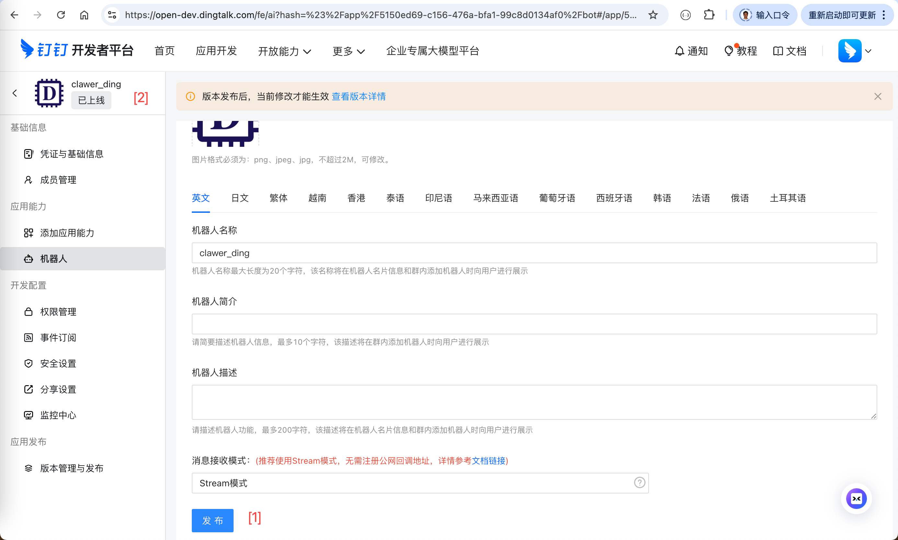
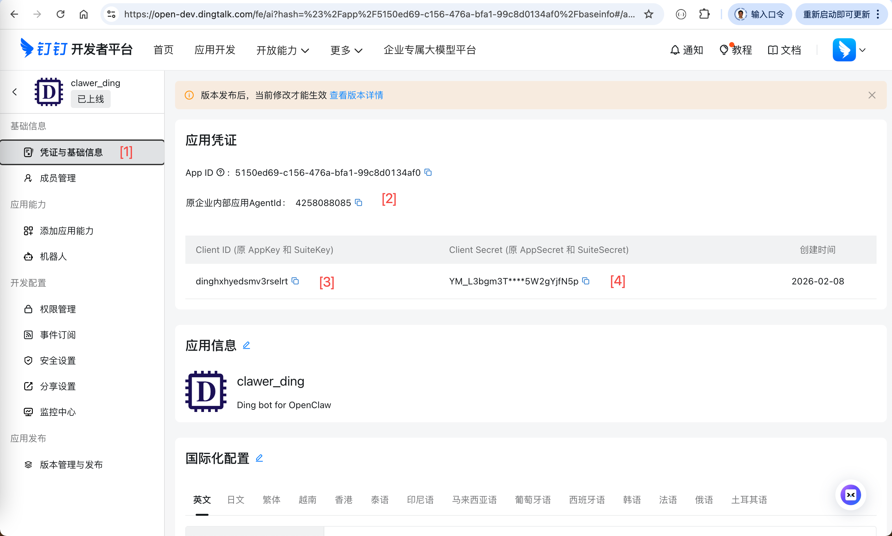
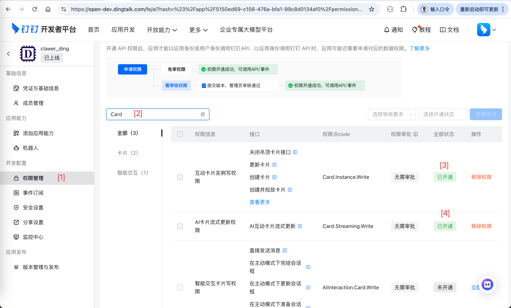
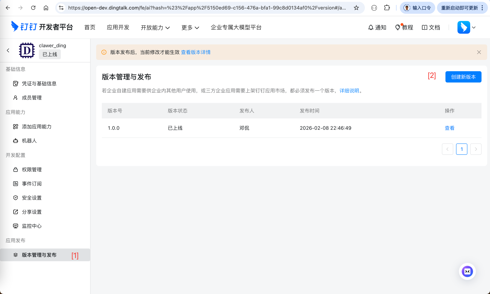

# Integrate Openclaw with Dingtalk

## 1. Objective

[Dingtalk](https://open.dingtalk.com/) is one of the popular instant messaging apps in China, 
especially many China's enterprises use Dingtalk as its communication tool, 
providing project management and OA services. 

However, the native [Openclaw](https://github.com/openclaw/openclaw) 
doesn't support Dingtalk as one of its channels. 

To integrate Openclaw with Dingtalk, we need to, 

1. Create a bot in Dingtalk,

2. Install a plugin to Openclaw channel.

&nbsp;
## 2. Create Dingtalk Bot

Follow the instruction of ["OpenClaw接入钉钉教程"](https://cloud.tencent.com/developer/article/2625121) 
or ["钉钉渠道配置指南"](https://github.com/BytePioneer-AI/openclaw-china/blob/main/doc/guides/dingtalk/configuration.md), 
to create a Dingtalk bot. 

Notice that you may prepare a company's license beforehand. 

* Enter the dingtalk developer main page.

  Take a record of the `CorpID`. 
  
   

     
     &nbsp;
     
   
  

* Create a new dingtalk app.

   

     
     &nbsp;
     
   
  

* Convert the app to a bot.

   

     
     &nbsp;
     
   
    

* Launch the bot.

  Take a record of `Agent ID`, `Client ID` and `Client Secret`.

   

     
     &nbsp;
     
   
    

* Grant the privileges and version control.

  Search for the privileges of `Card`, and grant the permissions.

   

     
     &nbsp;
     
   
 
  
   

&nbsp;
## 3. Install Openclaw-Dingtalk Plugin

&nbsp;
## 4. Use Openclaw in Dingtalk
