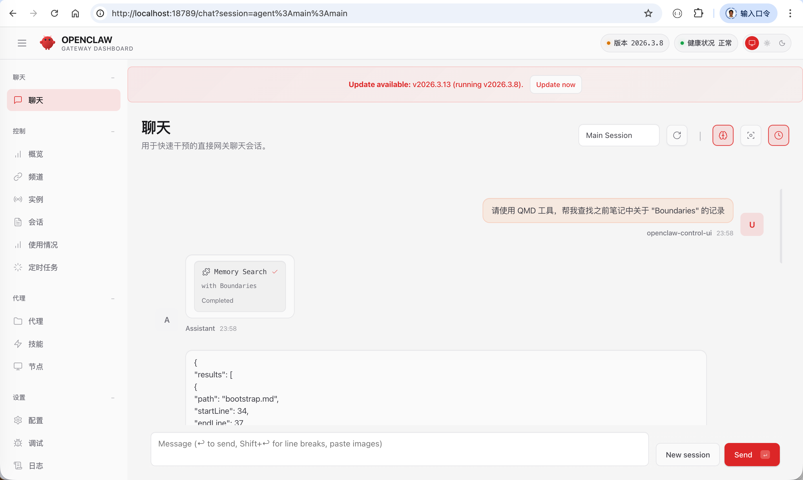
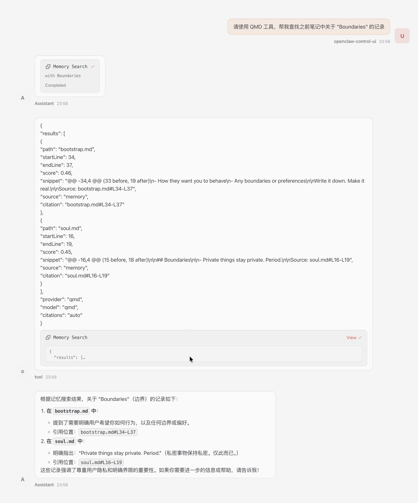

# Openclaw Essential Tools

## 1. Objective

This chapter is a step-by-step tutorial on the installation and usage of some essential tools of Openclaw, including

* [QMD](https://github.com/tobi/qmd)

* Live Chrome session attach

* Search

&nbsp;
## 2. Environment

## 2.1 Create a new user

~~~
root# useradd -m -s /usr/bin/bash claw_team
root# passwd claw_team
  New password: W**T**
  Retype new password: W**T**
  passwd: password updated successfully
  
root# usermod -aG sudo claw_team  
  
root# su - claw_team
  To run a command as administrator (user "root"), use "sudo <command>".
  See "man sudo_root" for details.

# From 'root' switches to 'claw_team'
claw_team$ 
~~~

## 2.2 Install npm

~~~
# Download and install nvm:
claw_team$ curl -o- https://raw.githubusercontent.com/nvm-sh/nvm/v0.40.4/install.sh | bash

# in lieu of restarting the shell
claw_team$ \. "$HOME/.nvm/nvm.sh"

# Download and install Node.js:
claw_team$ nvm install 24

# Verify npm version:
claw_team$ npm --version
11.9.0
claw_team$ node --version
v24.14.0

# Install pnpm
claw_team$ curl -fsSL https://get.pnpm.io/install.sh | sh -
  ==> Downloading pnpm binaries 10.32.0
  ...
  To start using pnpm, run:
  source /home/claw_team/.bashrc

claw_team$ source /home/claw_team/.bashrc
claw_team$ which pnpm
  /home/claw_team/.local/share/pnpm/pnpm
~~~

## 2.3 Install brew

~~~
claw_team$  /bin/bash -c "$(curl -fsSL https://raw.githubusercontent.com/Homebrew/install/HEAD/install.sh)"

  ==> Checking for `sudo` access (which may request your password)...
  ==> This script will install:
  /home/linuxbrew/.linuxbrew/bin/brew
  /home/linuxbrew/.linuxbrew/share/doc/homebrew
  ...
  ==> Next steps:
  - Run these commands in your terminal to add Homebrew to your PATH:
      echo >> /home/claw_team/.bashrc
      echo 'eval "$(/home/linuxbrew/.linuxbrew/bin/brew shellenv bash)"' >>   
      /home/claw_team/.bashrc
      eval "$(/home/linuxbrew/.linuxbrew/bin/brew shellenv bash)"
  - Install Homebrew's dependencies if you have sudo access:
      sudo apt-get install build-essential
    For more information, see:
      https://docs.brew.sh/Homebrew-on-Linux
  ==> Running `brew cleanup gcc`...
  Disable this behaviour by setting `HOMEBREW_NO_INSTALL_CLEANUP=1`.
  Hide these hints with `HOMEBREW_NO_ENV_HINTS=1` (see `man brew`).
      
claw_team$ echo >> /home/claw_team/.bashrc
claw_team$ echo 'eval "$(/home/linuxbrew/.linuxbrew/bin/brew shellenv bash)"' >> /home/claw_team/.bashrc
claw_team$ eval "$(/home/linuxbrew/.linuxbrew/bin/brew shellenv bash)"

claw_team$ sudo apt-get install build-essential  

claw_team$ brew install gcc
  ==> Fetching downloads for: gcc
  ...
~~~

&nbsp;
## 3. QMD (Query Markup Documents)

We followed the instructon of ["3 Essential Tools for OpenClaw"](https://x.com/_sean_matthew/status/2028902126005653889), 
but didn't use ClaudeCode. 

Additionally, notice that we use an alibaba ECS located in Virginia, US, so that we don't need to handle the GFW issue. 

~~~
Set up QMD as the memory backend for my OpenClaw agent.
Follow the official docs here:
https://docs.openclaw.ai/concepts/memory#qmd-backend-experimental

Make sure to:
1. Install the QMD CLI
2. Install SQLite with extension support if needed
   (macOS: brew install sqlite)
3. Configure memory.backend = "qmd" in my openclaw.json
4. Add my workspace memory files as a QMD collection
5. Run the initial embed so models are downloaded and
   the index is built
6. Verify it works by running a test query
~~~

&nbsp;
## 3.1 Install QMD and sqlite3

~~~
root# su - claw_team
claw_team$ pwd
  /home/claw_team/.openclaw
  
claw_team$ npm --version
  11.9.0
claw_team$ node --version
  v24.14.0

claw_team$ npm install -g @tobilu/qmd
npm warn deprecated prebuild-install@7.1.3: No longer maintained. Please contact the author of the relevant native addon; alternatives are available.
⠼
added 259 packages in 35s

claw_team$ brew install sqlite
==> Auto-updating Homebrew...
Adjust how often this is run with `$HOMEBREW_AUTO_UPDATE_SECS` or disable with
`$HOMEBREW_NO_AUTO_UPDATE=1`. Hide these hints with `$HOMEBREW_NO_ENV_HINTS=1` (see `man brew`).
...
==> Running `brew cleanup sqlite`...
Disable this behaviour by setting `HOMEBREW_NO_INSTALL_CLEANUP=1`.
Hide these hints with `HOMEBREW_NO_ENV_HINTS=1` (see `man brew`).

claw_team$ which sqlite3
/home/linuxbrew/.linuxbrew/bin/sqlite3
claw_team$ sqlite3 --version
3.52.0 2026-03-06 16:01:44 557aeb43869d3585137b17690cb3b64f7de6921774daae9e56403c3717dceab6 (64-bit)

~~~

&nbsp;
## 3.2 Automatically download LLM that runs on CPU

~~~
# Create a tempoerary collection
claw_team$ qmd collection add ~/qmd_notes --name notes
Creating collection 'notes'...
Collection: /home/claw_team/qmd_notes (**/*.md)
No files found matching pattern.
Indexed: 0 new, 0 updated, 0 unchanged, 0 removed
✓ Collection 'notes' created successfully

# Add context to help with search results, each piece of context will be returned 
# when matching sub documents are returned. 
# This works as a tree. This is the key feature of QMD as it allows LLMs 
# to make much better contextual choices when selecting documents. 
# Don't sleep on it!

claw_team$ qmd context add qmd://notes "Personal notes and ideas"
✓ Added context for: qmd://notes/ (collection root)
Context: Personal notes and ideas

# Generate embeddings for semantic search
claw_team$ qmd embed
✓ All content hashes already have embeddings.

# Run the search for the first time, expect to find nothing. 
# But it will automatically download and install a tiny LLM for reranking,
# tobil/qmd-query-expansion-1.7B, that runs on CPU.
# 
claw_team$ qmd query "quarterly planning process"
Expanding query...QMD Warning: no GPU acceleration, running on CPU (slow). Run 'qmd status' for details.
Downloading to ~/.cache/qmd/models
✔ hf_tobil_qmd-query-expansion-1.7B-q4_k_m.gguf downloaded 1.28GB in 4m
Downloaded to ~/.cache/qmd/models/hf_tobil_qmd-query-expansion-1.7B-q4_k_m.gguf
(290.6s)
├─ quarterly planning process
├─ lex: definition of quarterly planning
├─ vec: definition of quarterly planning and its significance
├─ vec: importance of setting quarterly goals for businesses
└─ hyde: The topic of quarterly planning process covers debates surrounding th...
Searching 5 queries...
No results found.

claw_team$ tree ~/.cache/qmd/models
/home/claw_team/.cache/qmd/models
└── hf_tobil_qmd-query-expansion-1.7B-q4_k_m.gguf
1 directory, 1 file

# Add a temporary MD file for testing.
claw_team$ mkdir -p ~/qmd_notes
claw_team$ cd qmd_notes/
claw_team$ curl https://raw.githubusercontent.com/cft0808/edict/main/README.md -o 三省六部.md
  % Total    % Received % Xferd  Average Speed   Time    Time     Time  Current
                                 Dload  Upload   Total   Spent    Left  Speed
100 29820  100 29820    0     0   284k      0 --:--:-- --:--:-- --:--:--  285k

# Update the QMD index
#
claw_team$ qmd update
Updating 1 collection(s)...
[1/1] notes (**/*.md)
Collection: /home/claw_team/qmd_notes (**/*.md)
Indexing: 1/1        
Indexed: 1 new, 0 updated, 0 unchanged, 0 removed
✓ All collections updated.
Run 'qmd embed' to update embeddings (1 unique hashes need vectors)

# QMD will automatically download and install another LLM that runs on CPU, to rerank the hybrid search results.
# This time, QMD downloaded, qwen3-reranker-0.6b-q8_0.gguf, 
# 
claw_team$ qmd query "尚书省"
Warning: 1 documents (100%) need embeddings. Run 'qmd embed' for better results.
Expanding query...QMD Warning: no GPU acceleration, running on CPU (slow). Run 'qmd status' for details.
 (8.4s)
├─ 尚书省
├─ lex: 汉朝尚书省
├─ lex: 古代尚书中书府
├─ vec: 汉朝尚书省
├─ vec: 古代尚书中书府
└─ hyde: The topic of 尚书省 covers 古代尚书中书府. Proper implementation follows establ...
Searching 6 queries...
Downloading to ~/.cache/qmd/models
✔ hf_ggml-org_qwen3-reranker-0.6b-q8_0.gguf downloaded 639.15MB in 1m
Downloaded to ~/.cache/qmd/models/hf_ggml-org_qwen3-reranker-0.6b-q8_0.gguf
 (91.4s)
qmd://notes/三省六部.md:8 #6bf8ae
Title: 🎬 Demo
Context: Personal notes and ideas
Score:  88%
@@ -7,4 @@ (6 before, 100 after)

  12 个 AI Agent（11 个业务角色 + 1 个兼容角色）组成三省六部：太子分拣、中书省规划、门下省审核封驳、尚书省派发、六部+吏部并行执行。 比 CrewAI 多一层<b>制度性审核</b>，比 AutoGen 多一个<b>实时看板</b>。

# So far, QMD has downloaded 3 LLMs for reranking.
#
# claw_team$ ls -la ~/.cache/qmd/models/
total 2197456
drwxrwxr-x 2 claw_team claw_team       4096 Mar 16 22:28 .
drwxrwxr-x 3 claw_team claw_team       4096 Mar 16 23:28 ..
-rw-rw-r-- 1 claw_team claw_team  328576992 Mar 16 22:28 hf_ggml-org_embeddinggemma-300M-Q8_0.gguf
-rw-rw-r-- 1 claw_team claw_team  639153184 Mar 16 22:26 hf_ggml-org_qwen3-reranker-0.6b-q8_0.gguf
-rw-rw-r-- 1 claw_team claw_team 1282438912 Mar 16 21:53 hf_tobil_qmd-query-expansion-1.7B-q4_k_m.gguf

# Remove the temporary collection.
# 
claw_team$ qmd collection remove notes
✓ Removed collection 'notes'
  Deleted 14 documents
  Cleaned up 1 orphaned content hashes

~~~

&nbsp;
## 3.3 Add collection

~~~
claw_team$ qmd collection add /home/claw_team/.openclaw/workspace --name workspace --mask "**/*.md"
Creating collection 'workspace'...
Collection: /home/claw_team/.openclaw/workspace (**/*.md)
Indexing: 7/7 ETA: 0s        
Indexed: 7 new, 0 updated, 0 unchanged, 0 removed
Run 'qmd embed' to update embeddings (7 unique hashes need vectors)
✓ Collection 'workspace' created successfully

claw_team$ qmd context add /home/claw_team/.openclaw/workspace "Agent workspace - memory files, daily logs, projects, skills"
✓ Added context for: qmd://workspace/
Context: Agent workspace - memory files, daily logs, projects, skills

# Generate embeddings for semantic search
#
claw_team$ qmd embed
✓ All content hashes already have embeddings.

# Update the QMD index
#
claw_team$ qmd update
Updating 1 collection(s)...

claw_team$ qmd query "Boundaries"
Warning: 7 documents (100%) need embeddings. Run 'qmd embed' for better results.
Expanding query...QMD Warning: no GPU acceleration, running on CPU (slow). Run 'qmd status' for details.
 (6.9s)
├─ Boundaries
└─ hyde: Boundaries is an important concept that relates to limit scenarios. I...
Searching 2 queries...
Embedding 2 queries... (740ms)
Reranking 2 chunks... (5.6s)

qmd://workspace/bootstrap.md:35 #5c4cb8
Title: BOOTSTRAP.md - Hello, World
Context: Agent workspace - memory files, daily logs, projects, skills
Score:  88%
@@ -34,4 @@ (33 before, 19 after)
- How they want you to behave
- Any boundaries or preferences
Write it down. Make it real.

qmd://workspace/soul.md:17 #95c467
Title: SOUL.md - Who You Are
Context: Agent workspace - memory files, daily logs, projects, skills
Score:  53%
@@ -16,4 @@ (15 before, 18 after)
## Boundaries

- Private things stay private. Period.
~~~

&nbsp;
## 3.4 Modify openclaw.json

Add `memory` section to ["/home/claw_team/.openclaw/openclaw.json"](./src/openclaw.json#L139-L151)
~~~
  "agents": {
    ...
  },
  "memory": {
    "backend": "qmd",
    "qmd": {
      "searchMode": "search",
      "includeDefaultMemory": true,
      "sessions": {
        "enabled": true
      },
      "paths": [
        { "name": "workspace", "path": "/home/claw_team/.openclaw/workspace", "pattern": "**/*.md" }
      ]
    }
  }
~~~

&nbsp;
## 3.5 Test QMD

In the Openclaw chat channel, type in a query, 
~~~
请使用 QMD 工具，帮我查找之前笔记中关于 "Boundaries" 的记录
~~~
Or, without mentioning QMD,
~~~
请帮我查找之前笔记中关于 "Boundaries" 的记录
~~~

The Openclaw will use QMD to do both keyword search and semantic search in the `/workspace` collection, 
and merge the two result lists using the CPU-based reranking LLM.

Following is the hybrid search results, 

  

    
  
  

  

    
  
  
