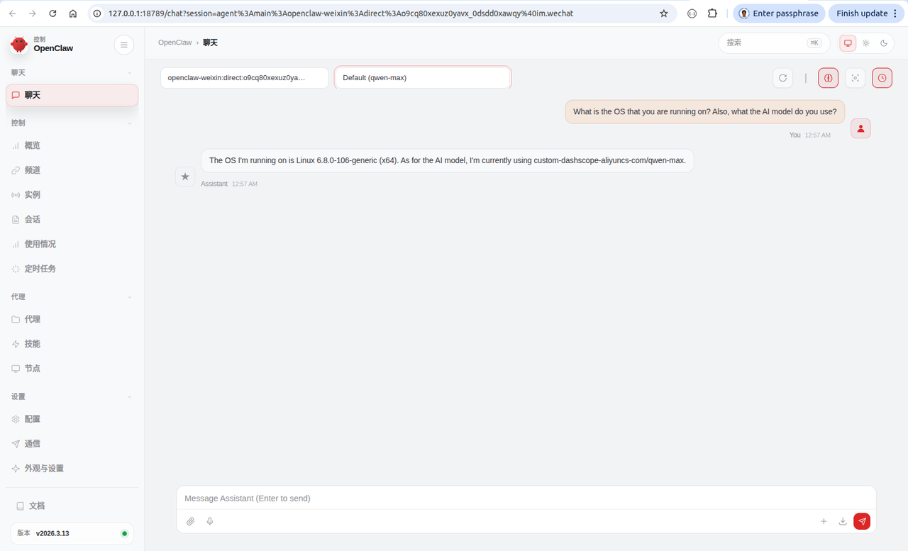
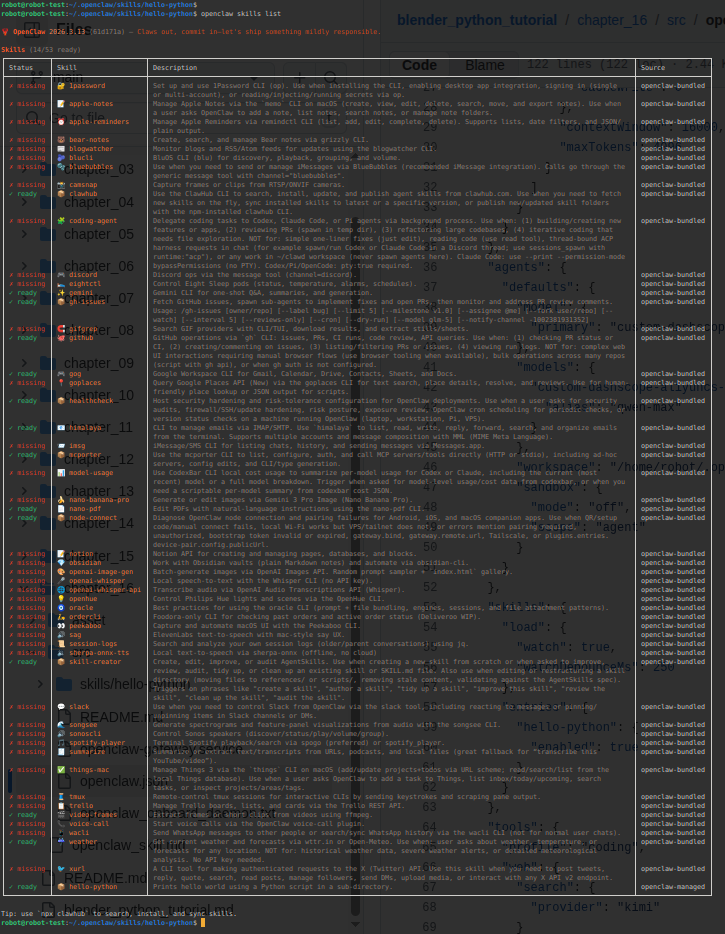
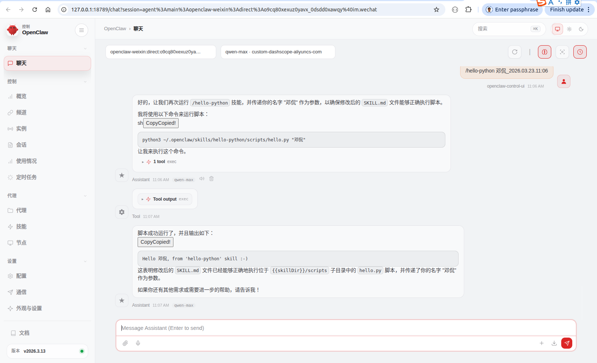
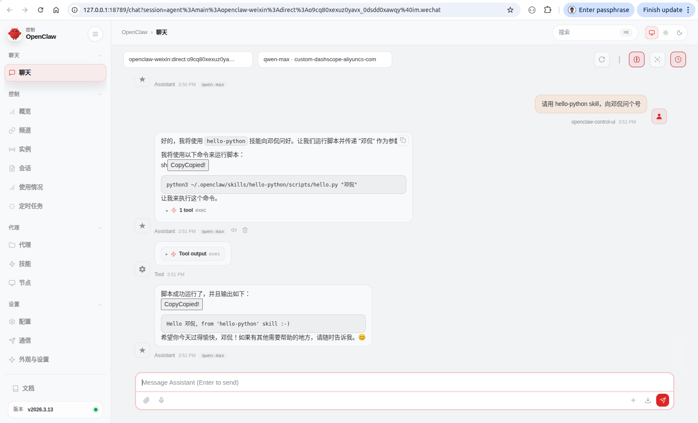
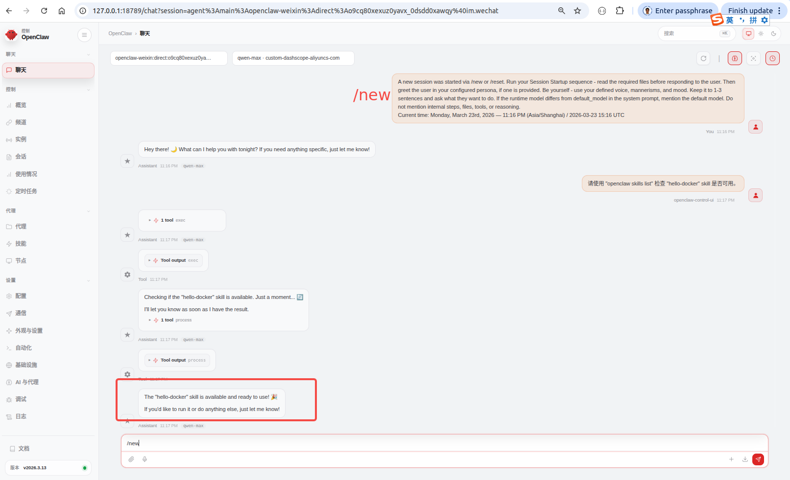
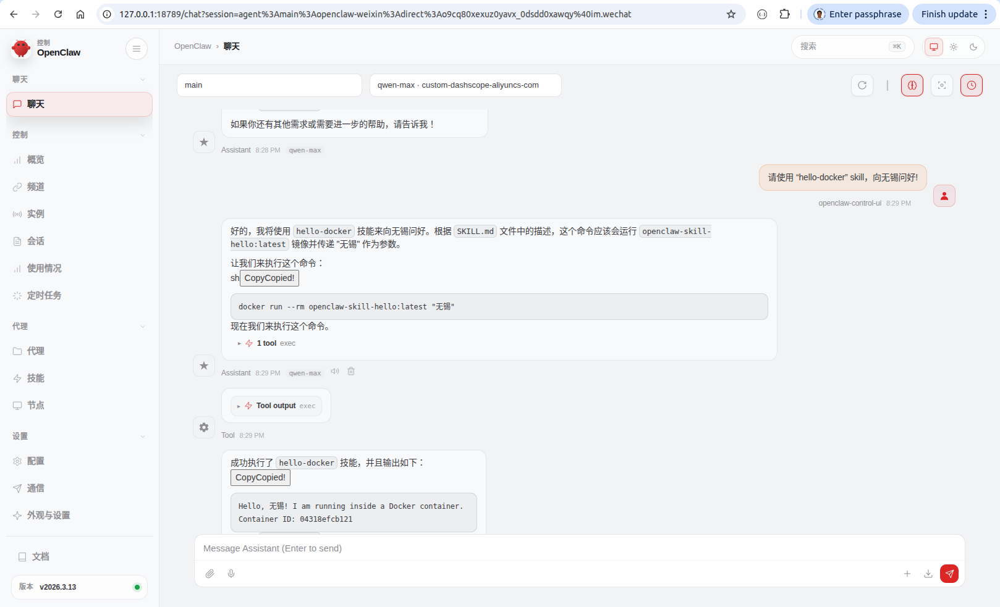

# Openclaw Skill and Plugin

## 1. Objective

This chapter is a step-by-step tutorial on how to install openclaw in a local Ubuntu laptop, 
and how to build custom skills, executing a python script directly, and indirectly in a docker sandbox.  

&nbsp;
## 2. Install Openclaw in local Ubuntu

### 2.1 Install nvm, node, npm and pnpm 

~~~
robot@robot-test:~$ pwd
/home/robot

robot@robot-test:~$ sudo apt update && sudo apt install -y curl wget

robot@robot-test:~$ curl -o- https://raw.githubusercontent.com/nvm-sh/nvm/v0.40.4/install.sh | bash

robot@robot-test:~$ nvm install 24

robot@robot-test:~$ node -v 
  v24.14.0
robot@robot-test:~$ npm -v
  11.9.0
  
# Install pnpm
robot@robot-test:~$ curl -fsSL https://get.pnpm.io/install.sh | sh -
  
robot@robot-test:~$ which pnpm
  /home/claw_team/.local/share/pnpm/pnpm
~~~

&nbsp;
### 2.2 Install openclaw

Following [the official installation guide of openclaw](https://docs.openclaw.ai/install#npm-or-pnpm),
we use `npm` to install openclaw. 

Look into [the snapshot of the installation and configuration of `openclaw onboard --install-daemon`](./src/openclaw_onboard_daemon.txt) for details. 

Notice that after the installation and configuration, 
openclaw automatically created a system daemon service in user session for itself. 

The systemd service definition file is `/home/robot/.config/systemd/user/openclaw-gateway.service`.

The usage of this systemd service refers to the next section, including `start`, `stop`, `status`, and `reload`. 

~~~
robot@robot-test:~$ pwd
/home/robot

robot@robot-test:~$ npm install -g openclaw@latest
npm warn deprecated node-domexception@1.0.0: Use your platform's native DOMException instead
added 540 packages in 1m
89 packages are looking for funding
  run `npm fund` for details

robot@robot-test:~$ openclaw onboard --install-daemon
# Look into the snapshot of the installation for the installation details.
# The --user systemd service is stored at:
# /home/robot/.config/systemd/user/openclaw-gateway.service
~~~

In case openclaw has been installed and uninstalled beforehand, 
there may be multiple `openclaw` executable files. 

In the following case, previously we executed the command `curl -fsSL https://openclaw.ai/install.sh | bash -s -- --no-onboard`, 
to install `openclaw`. 

Consequently, the previous openclaw executable is 
`/home/robot/.nvm/versions/node/v24.14.0/lib/node_modules/openclaw/openclaw.mjs`. 
  
And now we use `npm` to install `openclaw`, `npm install -g openclaw@latest`. 

Consequently, the current executable is `/home/linuxbrew/.linuxbrew/lib/node_modules/openclaw/openclaw.mjs`. 

~~~
robot@robot-test:~$ which openclaw
/home/linuxbrew/.linuxbrew/bin/openclaw

robot@robot-test:~$ ls -l /home/robot/.nvm/versions/node/v24.14.0/bin/openclaw
lrwxrwxrwx 1 robot robot 41 Mar 20 22:17 /home/robot/.nvm/versions/node/v24.14.0/bin/openclaw -> ../lib/node_modules/openclaw/openclaw.mjs

robot@robot-test:~$ ls -l /home/linuxbrew/.linuxbrew/bin/openclaw
lrwxrwxrwx 1 robot robot 41 Mar 23 00:36 /home/linuxbrew/.linuxbrew/bin/openclaw -> ../lib/node_modules/openclaw/openclaw.mjs
~~~

&nbsp;
### 2.3 Per-user instance of systemd manager

1. Edit [/home/robot/.config/systemd/user/openclaw-gateway.service](./src/openclaw-gateway.service#L8-L9),
   to comment off Restart and RestartSec.

2. Use `systemctl --user daemon-reload` to reload the systemd service.

3. User `systemctl --user {start, stop, status} openclaw-gateway.service` to `start`, `stop`, or look into the `status` of the systemd service.

Notice that `--user` flag is mandatory for the `openclaw-gateway.service`, because it is a *user* instance, instead of a *system-wide* instance. 

If using `sudo systemctl status openclaw-gateway.service`, the system will complain that `openclaw-gateway.service` cannot be found.

~~~
robot@robot-test:~/.openclaw$ systemctl --user stop openclaw-gateway.service
robot@robot-test:~/.openclaw$ pkill -f node
robot@robot-test:~/.openclaw$ pkill -f openclaw

robot@robot-test:~/.openclaw$ systemctl --user daemon-reload

robot@robot-test:~/.openclaw$ systemctl --user start openclaw-gateway.service

robot@robot-test:~/.openclaw$ systemctl --user status openclaw-gateway.service
● openclaw-gateway.service - OpenClaw Gateway (v2026.3.13)
     Loaded: loaded (/home/robot/.config/systemd/user/openclaw-gateway.service; enabled; vendor preset: enabled)
     Active: active (running) since Mon 2026-03-23 10:59:01 CST; 2s ago
   Main PID: 576267 (openclaw-gatewa)
      Tasks: 31 (limit: 38029)
     Memory: 477.9M
        CPU: 3.947s
     CGroup: /user.slice/user-1000.slice/user@1000.service/app.slice/openclaw-gateway.service
             └─576267 openclaw-gateway "" "" "" "" "" "" "" "" "" "" "" "" "" "" "" "" "" "" "" "" "" "" "" "" "" "" "" "" "" "" "" "" "" "" "" "" "" "" "" "" "" "" "" "" "" "" >

Mar 23 10:59:01 robot-test systemd[979]: Started OpenClaw Gateway (v2026.3.13).
lines 1-11/11 (END)

robot@robot-test:~/.openclaw$ sudo systemctl status openclaw-gateway.service
[sudo] password for robot: 
Unit openclaw-gateway.service could not be found.

robot@robot-test:~/.openclaw$ sudo systemctl --user status openclaw-gateway.service
Failed to connect to bus: $DBUS_SESSION_BUS_ADDRESS and $XDG_RUNTIME_DIR not defined (consider using --machine=<user>@.host --user to connect to bus of other user)

~~~

Open a chrome browser in the local ubuntu laptop, and visit `http://127.0.0.1:18789/`.

Following is a snapshot of the webchat, illustrating the successful outlook of the openclaw.

  

    
  
  

&nbsp;
## 3. Build managed local skill

In this section, we built a shared skill that runs a python script. 

This shared skill is named as *managed/local skill* in [Openclaw official document](https://docs.openclaw.ai/tools/skills#locations-and-precedence). 
It lives in a fixed directory, `~/.openclaw/skills`, and serves all agents on the same machine.

### 3.1 SKILL.md

In directory `~/.openclaw/skills`, we created a sub-directory [`hello-python`](./src/skills/hello-python) as following,

~~~
robot@robot-test:~/.openclaw$ pwd
/home/robot/.openclaw

robot@robot-test:~/.openclaw$ tree skills/
skills/
└── hello-python
    ├── scripts
    │   └── hello.py
    └── SKILL.md

2 directories, 2 files
~~~

Look into the content of [`hello-python/SKILL.md`](./src/skills/hello-python/SKILL.md), there are several points worth noting.

* Following [Openclaw's official guide](https://docs.openclaw.ai/tools/skills#format-agentskills-+-pi-compatible),
   the [`metadata`](https://raw.githubusercontent.com/kandeng/blender_python_tutorial/refs/heads/main/chapter_16/src/skills/hello-python/SKILL.md#:~:text=metadata%3A%20%7B%22openclaw%22%3A%20%7B%22requires%22%3A%20%7B%22bins%22%3A%20%5B%22python3%22%5D%7D%7D%7D)
   should be a single-line JSON object.

* To support slash command, `user-invocable` must be set to `true`.

* To make sure that openclaw can find the `scripts/hello.py`, we must add the [`### Notes`](https://raw.githubusercontent.com/kandeng/blender_python_tutorial/refs/heads/main/chapter_16/src/skills/hello-python/SKILL.md#:~:text=%23%23%23%20Notes%3A%0A%2D%20Ensure%20that%20%60%7B%7BskillDir%7D%7D%60%20is%20correctly%20resolved%20to%20the%20absolute%20path%20of%20the%20skill%20directory.%0A%2D%20The%20script%20%60hello.py%60%20should%20be%20placed%20in%20the%20%60scripts%60%20sub%2Ddirectory%20within%20the%20skill%20directory.) in the `SKILL.md`.

* `skillDir` is a reserved word in Openclaw, referring to `/home/robot/.openclaw/skills/hello-python` in this case. 

  
~~~
---
name: hello-python
description: "Prints hello world using a Python script in a sub-directory."
metadata: {"openclaw": {"requires": {"bins": ["python3"]}}}
user-invocable: true
---

# Hello Python

When the user wants to run the hello world test:
1. Use `python3` to execute the script.
2. The script is located at: `{{skillDir}}/scripts/hello.py`
3. Pass the user's name as an argument.

### Usage Example:

- "Run the hello python skill"
- "Greet Kanbo using the python script"

### Command:
`python3 {{skillDir}}/scripts/hello.py "{{name}}"`

### Notes:
- Ensure that `{{skillDir}}` is correctly resolved to the absolute path of the skill directory.
- The script `hello.py` should be placed in the `scripts` sub-directory within the skill directory.
~~~

&nbsp;
### 3.2 openclaw.json

Look into the content of [`openclaw.json`](./src/openclaw.json), there are several points worth noting.

* For a single agent, use [`agents.defaults`](https://raw.githubusercontent.com/kandeng/blender_python_tutorial/refs/heads/main/chapter_16/src/openclaw.json#:~:text=%22agents%22,%22%3A%C2%A0%7B), instead of `agents.list[0].defaults`.  

* Since we don't use docker sandbox, [`agents.sandbox.mode` is set to `off`](https://raw.githubusercontent.com/kandeng/blender_python_tutorial/refs/heads/main/chapter_16/src/openclaw.json#:~:text=%22sandbox%22,%7D).

  Notice that `sandbox` is configured inside `agents`.

* Refer to [the official documentation of Openclaw](https://docs.openclaw.ai/tools/skills#locations-and-precedence),
  ~~~
  <workspace>/skills (highest) → ~/.openclaw/skills → bundled skills (lowest)
  ~~~
  the `workspace/skills` and `~/.openclaw/skills` directories are pre-defined, so that we don't need to configure them in [`skills.load`](https://raw.githubusercontent.com/kandeng/blender_python_tutorial/refs/heads/main/chapter_16/src/openclaw.json#:~:text=%22load%22,%7D%2C) again. 

* When [`skills.entries.hello-python.enabled`](https://raw.githubusercontent.com/kandeng/blender_python_tutorial/refs/heads/main/chapter_16/src/openclaw.json#:~:text=%22hello%2Dpython,%7D) is set to `true`,
  `hello-python` skill will be registered by openclaw to be `ready` to use, referring to [the screenshot](./asset/openclaw_skill_list.png) of the result of running command `openclaw skills list`.
  ~~~
   ✓ ready    │ 📦 hello-python    │ Prints hello world using a Python script in a sub-directory.  │ openclaw-managed 
  ~~~

  
~~~
{
  ...
  "agents": {
    "defaults": {
      "model": {
        "primary": "custom-dashscope-aliyuncs-com/qwen-max"
      },
      "models": {
        "custom-dashscope-aliyuncs-com/qwen-max": {
          "alias": "qwen-max"
        }
      },
      "workspace": "/home/robot/.openclaw/workspace",
      "sandbox": {
        "mode": "off",
        "scope": "agent"
      }
    }
  },
  "skills": {
    "load": {
      "watch": true,
      "watchDebounceMs": 250      
    },
    "entries": {
      "hello-python": {
        "enabled": true
      }
    }
  },
  ...
}
~~~

  

    
  
  

&nbsp;
### 3.3 Test

Before we test the newly built `hello-python` skill, we need to restart the openclaw systemd service. 

~~~
robot@robot-test:~/.openclaw$ systemctl --user stop openclaw-gateway.service

robot@robot-test:~/.openclaw$ pkill -f node
robot@robot-test:~/.openclaw$ pkill -f openclaw

robot@robot-test:~/.openclaw$ systemctl --user start openclaw-gateway.service

robot@robot-test:~/.openclaw$ systemctl --user status openclaw-gateway.service
● openclaw-gateway.service - OpenClaw Gateway (v2026.3.13)
     Loaded: loaded (/home/robot/.config/systemd/user/openclaw-gateway.service; enabled; vendor preset: enabled)
     Active: active (running) since Mon 2026-03-23 10:59:01 CST; 2h 28min ago
   Main PID: 576267 (openclaw-gatewa)
      Tasks: 31 (limit: 38029)
     Memory: 553.4M
        CPU: 32.759s
     CGroup: /user.slice/user-1000.slice/user@1000.service/app.slice/openclaw-gateway.service
             └─576267 openclaw-gateway "" "" "" "" "" "" "" "" "" "" "" "" "" "" "" "" "" "" "" "" "" "" "" "" "" "" "" "" "" "" "" "" "" "" "" "" "" "" "" "" "" "" "" "" "" "" >

Mar 23 11:02:34 robot-test node[576267]: 2026-03-23T11:02:34.257+08:00 [compaction-safeguard] Compaction safeguard: cancelling compaction with no real conversation messages to s>
Mar 23 11:02:43 robot-test node[576267]: 2026-03-23T11:02:43.991+08:00 [compaction-safeguard] Compaction safeguard: cancelling compaction with no real conversation messages to s>
...
~~~

To test the slash command, we can input "/hello-python 邓侃_2026.03.23.11:06" in the input box of the Openclaw's webchat. 

Interestingly, Openclaw automatically deleted the timestamp "2026.03.23.11:06" from the input argument. 

  

    
  
  

To test the intent usage of a skill, we can send a message "请用 hello-python skill，向邓侃问个好" in the Openclaw's webchat. 

Notice that if missing "请用 hello-python skill", simply say "向邓侃问个好", the `hello-python` skill will not be invoked. 

  

    
  
  

&nbsp;
## 4. Build docker containerized skill

In this section, we built a shared managed/local skill that sends a command to our host's docker engine to spin up a temporary container, 
then runs a python script in the docker container, returns the result, finally, remove the temporary container. 

### 4.1 Build the docker image

In directory `~/.openclaw/skills`, we created a sub-directory [`hello-docker`](./src/skills/hello-docker) as following,

~~~
robot@robot-test:~/.openclaw$ pwd
/home/robot/.openclaw

robot@robot-test:~/.openclaw$ tree skills
skills
├── hello-docker
│   ├── Dockerfile
│   ├── scripts
│   │   └── hello.py
│   └── SKILL.md
└── hello-python
    ├── scripts
    │   └── hello.py
    └── SKILL.md

4 directories, 5 files
~~~

* We created the `Dockerfile` file with the following content. 

  Notice that to build the docker image, it relies on `python:3.12-slim` that is a docker image for python 3.12 runtime, 
available at [the docker hub](https://hub.docker.com/layers/library/python/3.12-slim/images/sha256-f0c6bc1ab7b1ab270bbb612a31a67a7938d6171183ddce9121f04984ab3df44e). 

  ~~~
  # Use a slim Python 3.12 image
  FROM python:3.12-slim

  # Set the working directory inside the container
  WORKDIR /app

  # Copy the script into the container
  COPY scripts/hello.py .

  # Set the command to run the script
  ENTRYPOINT ["python", "hello.py"]
  ~~~

* After we have made the `Dockerfile` file, we used it to build the docker image, 
  ~~~
  $ sudo docker build -t openclaw-skill-hello:latest .
  ~~~

  ~~~
  robot@robot-test:~/.openclaw/skills/hello-docker$ which docker
  /usr/local/bin/docker
  robot@robot-test:~/.openclaw/skills/hello-docker$ docker --version
  Docker version 29.1.3, build f52814d

  robot@robot-test:~/.openclaw/skills/hello-docker$ sudo docker build -t openclaw-skill-hello:latest .
  [sudo] password for robot: 
  [+] Building 87.5s (8/8) FINISHED                                                                                                                                  docker:default
   => [internal] load build definition from Dockerfile                                                                                                                         0.0s
   => => transferring dockerfile: 287B                                                                                                                                         0.0s
   => [internal] load metadata for docker.io/library/python:3.12-slim                                                                                                         69.3s
   => [internal] load .dockerignore                                                                                                                                            0.1s
   => => transferring context: 2B                                                                                                                                              0.0s
   => [1/3] FROM docker.io/library/python:3.12-slim@sha256:3d5ed973e45820f5ba5e46bd065bd88b3a504ff0724d85980dcd05eab361fcf4                                                   17.6s
   ...
   => => transferring context: 412B                                                                                                                                            0.0s
   => [2/3] WORKDIR /app                                                                                                                                                       0.1s
   => [3/3] COPY scripts/hello.py .                                                                                                                                            0.1s
   => exporting to image                                                                                                                                                       0.2s
   => => exporting layers                                                                                                                                                      0.1s
   => => writing image sha256:60e665ebb854da803114cb7c1a7974aac16de402cdeb5d84ca5d5b048f913633                                                                                 0.0s
   => => naming to docker.io/library/openclaw-skill-hello:latest                                                                                                               0.0s

  robot@robot-test:~/.openclaw/skills/hello-docker$ sudo ls -l /var/lib/docker/
  total 52
  drwx--x--x  4 root root  4096 Apr 10  2024 buildkit
  drwx--x--- 10 root root  4096 Mar 22 21:41 containers
  -rw-------  1 root root    36 Apr 10  2024 engine-id
  drwx------  3 root root  4096 Apr 10  2024 image
  drwxr-x---  3 root root  4096 Apr 10  2024 network
  drwx--x--- 85 root root 12288 Mar 23 18:14 overlay2
  drwx------  4 root root  4096 Apr 10  2024 plugins
  drwx------  2 root root  4096 Mar 22 17:09 runtimes
  drwx------  2 root root  4096 Apr 10  2024 swarm
  drwx------  3 root root  4096 Mar 23 18:14 tmp
  drwx-----x  2 root root  4096 Mar 22 17:09 volumes

  robot@robot-test:~/.openclaw/skills/hello-docker$ sudo ls -l /var/lib/docker/overlay2
  total 332
  ...

  robot@robot-test:~/.openclaw/skills/hello-docker$ sudo ls -l /var/lib/docker/image
  total 4
  drwx------ 5 root root 4096 Mar 23 18:14 overlay2
  
  robot@robot-test:~/.openclaw/skills/hello-docker$ sudo ls -l /var/lib/docker/image/overlay2
  total 16
  drwx------ 4 root root 4096 Apr 10  2024 distribution
  drwx------ 4 root root 4096 Apr 10  2024 imagedb
  drwx------ 5 root root 4096 Apr 10  2024 layerdb
  -rw------- 1 root root 2742 Mar 23 18:14 repositories.json

  robot@robot-test:~/.openclaw/skills/hello-docker$ sudo more /var/lib/docker/image/overlay2/repositories.json
  {"Repositories":{"debian":{"debian:bookworm-slim":"sha256:d6b3...","debian@sha256:f065..."}}...}}
  ~~~

* After we have built the docker image, we can double check if `openclaw-skill-hello:latest` does exist in the image list. 
  ~~~
  $ docker images
  ~~~

  ~~~
  robot@robot-test:~/.openclaw/skills/hello-docker$ docker images
                                                  i Info →   U  In Use
  IMAGE                                           ID             DISK USAGE   CONTENT SIZE   EXTRA
  debian:bookworm-slim                            d6b3fe87704b       74.8MB             0B    U   
  hello-world:latest                              d2c94e258dcb       13.3kB             0B    U   
  hello_docker_image:latest                       d483c6ff84b5        124MB             0B        
  my-local-hello:v1                               d483c6ff84b5        124MB             0B        
  nvidia/cuda:11.6.2-base-ubuntu20.04             2098e65daccd        154MB             0B    U   
  openclaw-sandbox:bookworm-slim                  d6b3fe87704b       74.8MB             0B    U   
  openclaw-skill-hello:latest                     60e665ebb854        119MB             0B        
  registry.cn-hangzhou.aliyuncs.com/ossrs/srs:5   5a4b3440626f        156MB             0B        
  registry.cn-hangzhou.aliyuncs.com/ossrs/srs:6   298b47d809f9        158MB             0B        
  ros:latest                                      47cf82a0a3b2        752MB             0B        
  ros:noetic-robot                                c09cd3d5f497        985MB             0B    U   

  robot@robot-test:~/.openclaw/skills/hello-docker$ docker images openclaw-skill-hello:latest
                                i Info →   U  In Use
  IMAGE                         ID             DISK USAGE   CONTENT SIZE   EXTRA
  openclaw-skill-hello:latest   60e665ebb854        119MB             0B        
  ~~~

&nbsp;
### 4.2 SKILL.md

Look into the content of [`hello-docker/SKILL.md`](./src/skills/hello-docker/SKILL.md), notice that,

* the content of `### Implementation Command` is, 
  ~~~
  docker run --rm openclaw-skill-hello:latest "{{name}}"
  ~~~

* `openclaw-skill-hello:latest` is the name of the docker image that we built just now.
  
~~~
---
name: hello-docker
description: "Invokes a Python 'Hello World' script inside a Docker container."
metadata: {"openclaw": {"requires": {"bins": ["docker"]}}}
user-invocable: true
---

# Hello Docker Skill

When the user asks for a containerized greeting:
1. Ensure the docker image `openclaw-skill-hello:latest` is built.
2. Run the container using the following command.
3. Pass the user's name as an argument.

### Implementation Command:
`docker run --rm openclaw-skill-hello:latest "{{name}}"`

### Security Note:
The `--rm` flag ensures the container is deleted immediately after printing the message to keep the robot's system clean.
~~~

To verify if the command is executable, we can run it in CLI terminal,

~~~
robot@robot-test:~/.openclaw/skills/hello-docker$ docker run --rm openclaw-skill-hello:latest 无锡
Hello, 无锡! I am running inside a Docker container.
Container ID: eef00bba1c2c
~~~

&nbsp;
### 4.3 openclaw.json

Look into the content of [`openclaw.json`](./src/openclaw.json), there are several points worth noting. 

* We add [`hello-docker` to `skills.entries`](https://raw.githubusercontent.com/kandeng/blender_python_tutorial/refs/heads/main/chapter_16/src/openclaw.json#:~:text=%22hello%2Ddocker,%7D),
  ~~~
  {
    ...
    "skills": {
      "load": {
        "watch": true,
        "watchDebounceMs": 250      
      },
      "entries": {
        "hello-python": {
          "enabled": true
        },
        "hello-docker": {
          "enabled": true
        }
      }
    },
    ...
  }
  ~~~

* Keep [`agents.defaults.sandbox.mode`](https://raw.githubusercontent.com/kandeng/blender_python_tutorial/refs/heads/main/chapter_16/src/openclaw.json#:~:text=%22sandbox%22,%7D) unchanged, still be `"mode": "off"`,

  ~~~
  {
    ...
    "agents": {
      "defaults": {
        ...
        "sandbox": {
          "mode": "off",
          "scope": "agent"
        }
      }
    },
    ...
  }
  ~~~

  
&nbsp;
### 4.4 Test

* Restart the systemd service

  Before we test the newly built `hello-docker` skill, we need to restart the openclaw systemd service. 

  ~~~
  robot@robot-test:~/.openclaw$ systemctl --user stop openclaw-gateway.service
  
  robot@robot-test:~/.openclaw$ pkill -f openclaw
  robot@robot-test:~/.openclaw$ pkill -f node
  
  robot@robot-test:~/.openclaw$ systemctl --user start openclaw-gateway.service
  
  robot@robot-test:~/.openclaw$ systemctl --user status openclaw-gateway.service
  ● openclaw-gateway.service - OpenClaw Gateway (v2026.3.13)
       Loaded: loaded (/home/robot/.config/systemd/user/openclaw-gateway.service; enabled; vendor preset: enabled)
       Active: active (running) since Mon 2026-03-23 23:15:17 CST; 7s ago
     Main PID: 1199978 (openclaw-gatewa)
        Tasks: 31 (limit: 38029)
       Memory: 1.3G
          CPU: 10.730s
       CGroup: /user.slice/user-1000.slice/user@1000.service/app.slice/openclaw-gateway.service
               └─1199978 openclaw-gateway ...>
  Mar 23 23:15:17 robot-test systemd[979]: Started OpenClaw Gateway (v2026.3.13).
  ~~~

* Refresh

  When we added a new skill `hello-docker` to `~/.openclaw/skills` directory,
  the Openclaw gateway saw the new sub-directory almost immediately due to the setting of [`skills.load.watch`](https://raw.githubusercontent.com/kandeng/blender_python_tutorial/refs/heads/main/chapter_16/src/openclaw.json#:~:text=%22load%22,%7D%2C).
  This is the reason that `hello-docker` skill appear in the result of `openclaw skills list` command.

  However, the agent loads a *snapshot* of the available skills at the exact moment a session starts.

  Because we created the `hello-docker` skill after we opened our current webchat UI,
  that specific session didn't have the skill in its "known tools" list *snapshot*.

  To refresh the *snapshot* of the available skills, we can

  (1) run a slash command `/new` in the input box of the webchat,
     
  (2) ask the openclaw agent to run the command `openclaw skills list`, to trigger a forced refresh of the skill discovery service.
 
  

    
  
  

* Test

  We can use both slash command `/hello-docker 南京` and message to use the new skill. The internal process is that

  (1) the openclaw agent sends a command to our host's docker engine to spin up a temporary docker container,
     
  (2) run our `hello.py` script inside the docker container,
    
  (3) return the result to the channel, in this case, the channel is the webchat webpage,
 
  (4) remove the temporary instance of the image container.

  

    
  
  
  
