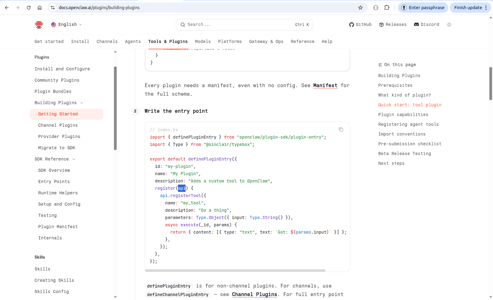
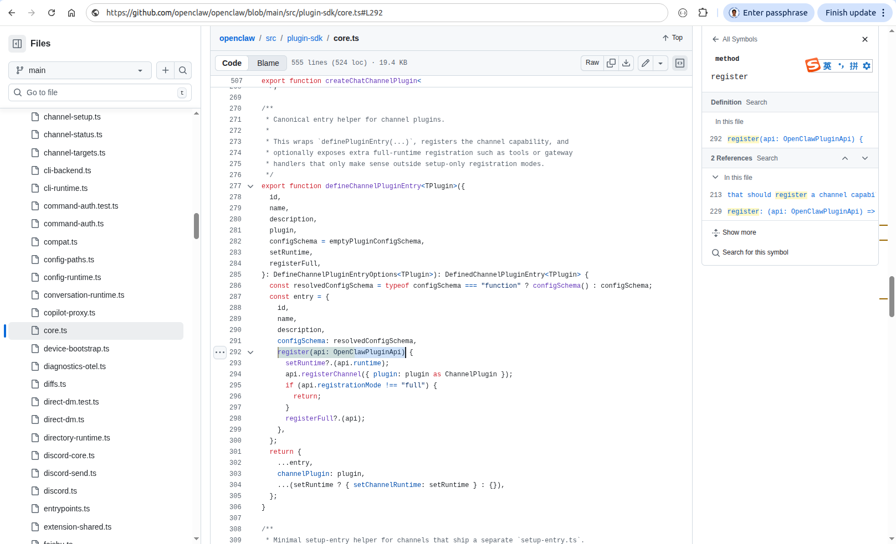
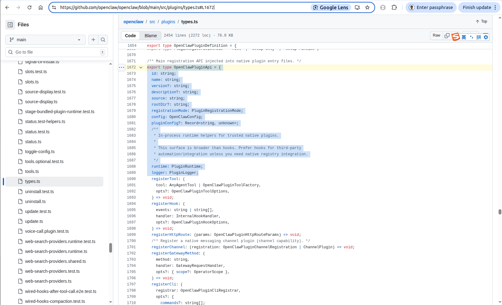
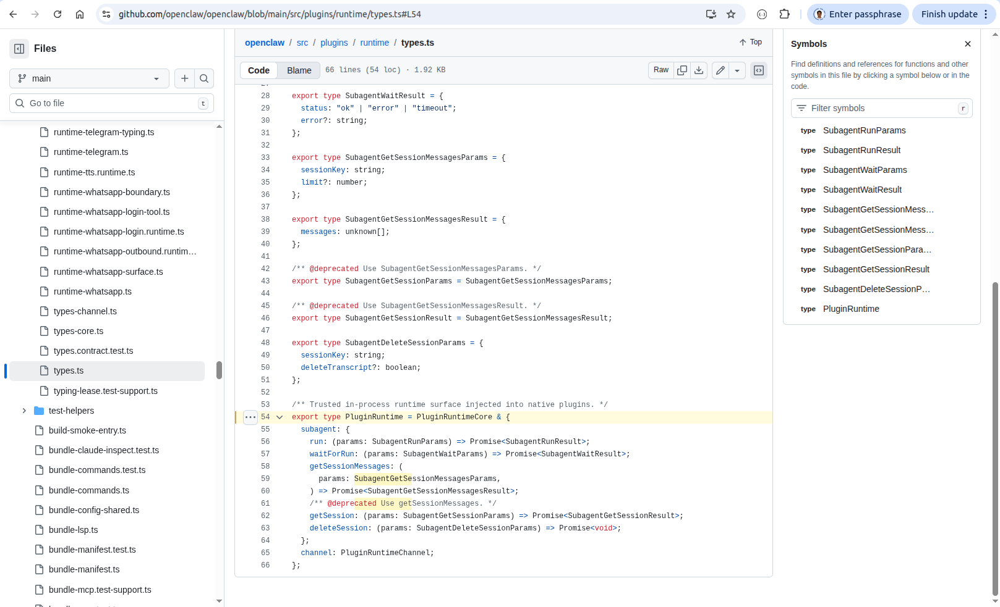

# Openclaw Plugin and Hook

## 1. Objective

This chapter is a step-by-step tutorial on how to build a custom tool plugin in a local Ubuntu laptop.  

In addition, we built a tool-hook plugin paired with a node, that is actually a system daemon service. 
The plugin contains a websocker client, bi-directionally communicating with the node that contains a websocket server. 

&nbsp;
## 2. The difference between plugin and skill

Plugin is a package, that contains one or multiple tools, hooks, channels, providers etc.   

The tools, hooks, channels, providers inside a plugin can have their own `SKILL.md` respectively. 
You can specify their `SKILL.md`'s in the `skills/` field of the `openclaw.plugin.json`, 
referring to the ["plugin manifest"](https://docs.openclaw.ai/plugins/manifest#top-level-field-reference).

Those `SKILL.md`'s instruct the openclaw gateway how to use one or more specific tools, hooks, channels, providers of the plugin package, 
rather than the entire plugin package. \
The names of the tools, hooks, channels, providers of the plugin package， must be identical to the `name` of `definePluginEntry` 
in the `index.ts` script of the plugin package,
~~~
// index.ts
import { definePluginEntry } from "openclaw/plugin-sdk/plugin-entry";
import { Type } from "@sinclair/typebox";

export default definePluginEntry({
  id: "my-plugin",
  name: "My Plugin",
  description: "Adds a custom tool to OpenClaw",
  register(api) {
    api.registerTool({
      name: "my_tool",
      description: "Do a thing",
      parameters: Type.Object({ input: Type.String() }),
      async execute(_id, params) {
        return { content: [{ type: "text", text: `Got: ${params.input}` }] };
      },
    });
  },
});
~~~

When the openclaw gateway starts a new session, it scans all the related file directories and their sub-directories, 
looking for files named as `SKILL.md`. The "related file directories" include, 

1. the default skill directory, `~/.openclaw/skills`,
2. the directories specified in the `extraDirs` field of the `openclaw.json` configuration file,
3. the directories specified in the `skills` field of the `openclaw.plugin.json` of the various plugin packages.

After scanning the skills, the openclaw gateway use them in the same way, no matter it is a regular skill, 
or the specific skill of a tool inside a plugin package. 

Even though it is functional to define the filepaths of the plugin's skills, 
in the `extraDirs` field of the `openclaw.json` configuration file,
it is better to define the filepaths in the `skills` field of the `openclaw.plugin.json` of the plugin's configuration file.
The reason is that possibly the priority of the `skills` field of the `openclaw.plugin.json`, 
is higher than the `extraDirs` field of the `openclaw.json`. 
Consequently, there are more chanced be used for the skills defined in the `skills` field of the `openclaw.plugin.json`.

The fundamental difference between a regular skill and a tool inside a plugin package is that 
the tool plugin runs *inside* the openclaw gateway, so that it has access to the session context of the openclaw gateway. 
However, the regular skill runs *outside*, it cannot get any internal information of the session. 

[The appendix at the end of this article](./openclaw_plugin_node.md#appendix-the-proof-that-a-tool-plugin-has-access-to-the-session-context) gives the detailed proof our statement that 
"the tool plugin runs *inside* the openclaw gateway, so that it has access to the session context". 

&nbsp;
## 3. Install openclaw cleanly

If you have already installed openclaw, double check its package in the directory like  
`/home/robot/.nvm/versions/node/v24.14.0/lib/node_modules/openclaw/dist/`.

Especially, that directory is the only directory for openclaw, and does NOT exist another one simultaneously, like 
`/home/linuxbrew/.linuxbrew/lib/node_modules/openclaw`.

If needed, uninstall openclaw completely, and reinstall it from scratch, cleanly. 

1. Use the `curl` way to install openclaw,
   
  ~~~
  robot@robot-test:~$ curl -fsSL https://openclaw.ai/install.sh | bash -s -- --no-onboard
  ~~~

  Here is [the log of running this command](./src/openclaw_curl_install.md). 
  
  Notice that it will install the openclaw package in a directory like 
  `/home/robot/.nvm/versions/node/v24.14.0/lib/node_modules/openclaw/dist/`.

2. Install the system daemon service for openclaw gateway,
   
  ~~~
  robot@robot-test:~$ openclaw onboard --install-daemon
  ~~~

  Here is [the log of running this command](./src/openclaw_onboard.md).
  
  Notice that do NOT use `homebrew` to install the skills like `gemini` and `github`, 
  otherwise, it will create another directory for the openclaw package, 
  `/home/linuxbrew/.linuxbrew/lib/node_modules/openclaw`.

&nbsp;
## 4. code, config, and skill

We built a sample tool plugin `hello-tool-plugin`, its file structure is displayed below. To understand the entire package, we only need to look into a few key files. 
~~~
robot@robot-test:~/.openclaw$ pwd
/home/robot/.openclaw

robot@robot-test:~/.openclaw$ ls -la
total 72
drwx------ 11 robot robot 4096 Mar 29 18:12 .
drwxr-x--- 97 robot robot 4096 Mar 29 18:13 ..
drwxrwxr-x  2 robot robot 4096 Mar 30 10:17 devices
drwx------  2 robot robot 4096 Mar 26 10:26 logs
drwxrwxr-x  3 robot robot 4096 Mar 26 22:05 nodes
-rw-------  1 robot robot 2969 Mar 29 18:12 openclaw.json
drwxrwxr-x  5 robot robot 4096 Mar 28 10:42 plugins
...

robot@robot-test:~/.openclaw$ tree plugins/hello-tool-plugin/
plugins/hello-tool-plugin/
├── package.json
├── openclaw.plugin.json
├── tsconfig.json
├── tsup.config.ts
├── pnpm-lock.yaml

├── skills
│   ├── tool_one
│   │   └── SKILL.md
│   └── tool_two
│       └── SKILL.md

├── src
│   ├── index.ts
│   ├── service.ts
│   ├── plugin-api.ts
│   └── transport
│       ├── factory.ts
│       └── websocket_client.ts

├── node_modules
│   └── ...
└── dist
    └── ...

18 directories, 15 files
~~~

&nbsp;
### 4.1 openclaw.json

Following is the settings of the `openclaw.json` that are related to the `skill`, `tool`, `hook`, and `plugin`. 

~~~
{
  ...
  "skills": {
    "load": {
      "extraDirs": [],
      "watch": true
    }
  },
  "tools": {
    "profile": "full",
    "exec": {
      "host": "gateway",
      "backgroundMs": 10000,
      "timeoutSec": 1800,
      "cleanupMs": 1800000,
      "notifyOnExit": true,
      "notifyOnExitEmptySuccess": false,
      "applyPatch": {
        "enabled": false,
        "allowModels": [
          "qwen-max"
        ]
      }
    }
  },
  "hooks": {
    "internal": {
      "enabled": true,
      "entries": {
        "command-logger": {
          "enabled": true
        }
      }
    }
  },
  "plugins": {
    "enabled": true,
    "allow": [
      "hello-plugin",
      "robot-hook",
      "hello-tool-plugin"
    ],
    "load": {
      "paths": [
        "/home/robot/.openclaw/plugins"
      ]
    },
    "entries": {
      "hello-plugin": {
        "enabled": true
      },
      "robot-hook": {
        "enabled": true
      },
      "hello-tool-plugin": {
        "enabled": true
      }
    }
  },
  ...
}
~~~

&nbsp;
## 5. pnpm install and build

~~~
$ pnpm install
$ pnpm build
$ openclaw plugins inspect "hello-tool-plugin"
~~~

&nbsp;
## Appendix. The proof that a tool plugin has access to the session context

1. The tool inside a plugin package has access to
   [`api`](https://docs.openclaw.ai/plugins/building-plugins#quick-start-tool-plugin),
   

     
   
  

2. `api` is an instance of
   [`OpenClawPluginApi`](https://github.com/openclaw/openclaw/blob/main/src/plugin-sdk/core.ts#L292),
   

     
   
  

3. The most important content that `OpenClawPluginApi` contains is
   [`runtime:PluginRuntime`](https://github.com/openclaw/openclaw/blob/main/src/plugins/types.ts#L1688)
   

     
   
 

4. [`PluginRuntime`](https://github.com/openclaw/openclaw/blob/main/src/plugins/runtime/types.ts#L54)
   is an entrance to the session context of the openclaw gateway. 
   

     
   
 
