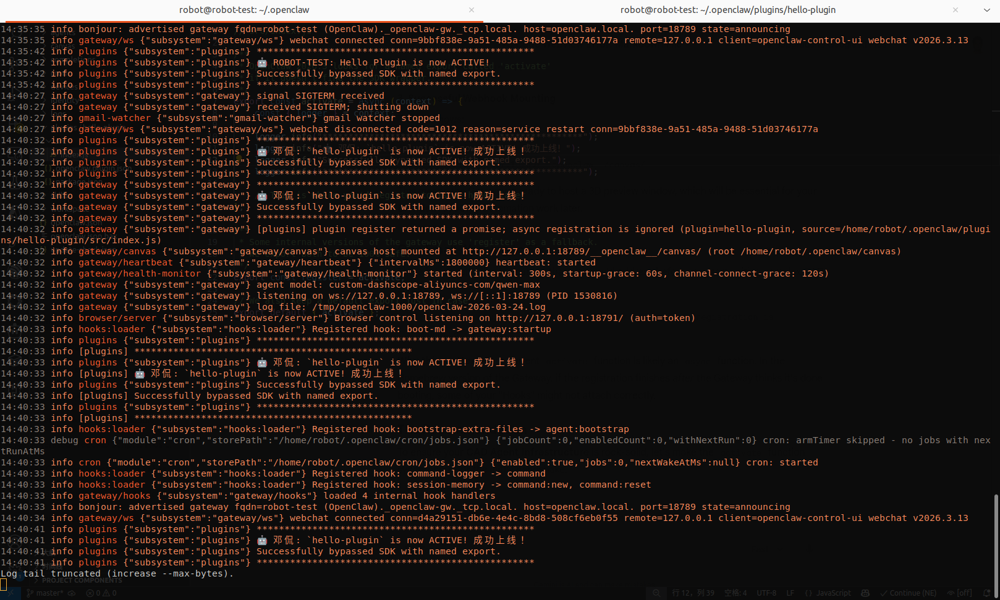

# Openclaw Plugin and Hook

## 1. Objective

This chapter is a step-by-step tutorial on how to build a custom tool plugin in a local Ubuntu laptop.  

In addition, we built a tool-hook plugin paired with a node, that is actually a system daemon service. 
The plugin contains a websocker client, bi-directionally communicating with the node that contains a websocket server. 

&nbsp;
## 2. The difference between plugin and skill

Plugin is a package, that contains one or multiple tools, hooks, channels, providers etc.   

The tools, hooks, channels, providers inside a plugin can have their own `SKILL.md` respectively. 
You can specify their `SKILL.md`'s in the `skills/` field of the `openclaw.plugin.json`, 
referring to the ["plugin manifest"](https://docs.openclaw.ai/plugins/manifest#top-level-field-reference).

Those `SKILL.md`'s instruct the openclaw gateway how to use one or more specific tools, hooks, channels, providers of the plugin package, 
rather than the entire plugin package. \
The names of the tools, hooks, channels, providers of the plugin package， must be identical to the `name` of `definePluginEntry` 
in the `index.ts` script of the plugin package,
~~~
// index.ts
import { definePluginEntry } from "openclaw/plugin-sdk/plugin-entry";
import { Type } from "@sinclair/typebox";

export default definePluginEntry({
  id: "my-plugin",
  name: "My Plugin",
  description: "Adds a custom tool to OpenClaw",
  register(api) {
    api.registerTool({
      name: "my_tool",
      description: "Do a thing",
      parameters: Type.Object({ input: Type.String() }),
      async execute(_id, params) {
        return { content: [{ type: "text", text: `Got: ${params.input}` }] };
      },
    });
  },
});
~~~

When the openclaw gateway starts a new session, it scans all the related file directories and their sub-directories, 
looking for files named as `SKILL.md`. The "related file directories" include, 

1. the default skill directory, `~/.openclaw/skills`,
2. the directories specified in the `extraDirs` field of the `openclaw.json` configuration file,
3. the directories specified in the `skills` field of the `openclaw.plugin.json` of the various plugin packages.

After scanning the skills, the openclaw gateway use them in the same way, no matter it is a regular skill, 
or the specific skill of a tool inside a plugin package. 

Even though it is functional to define the filepaths of the plugin's skills, 
in the `extraDirs` field of the `openclaw.json` configuration file,
it is better to define the filepaths in the `skills` field of the `openclaw.plugin.json` of the plugin's configuration file.
The reason is that possibly the priority of the `skills` field of the `openclaw.plugin.json`, 
is higher than the `extraDirs` field of the `openclaw.json`. 
Consequently, there are more chanced be used for the skills defined in the `skills` field of the `openclaw.plugin.json`.

The fundamental difference between a regular skill and a tool inside a plugin package is that 
the tool plugin runs *inside* the openclaw gateway, so that it has access to the session context of the openclaw gateway. 
However, the regular skill runs *outside*, it cannot get any internal information of the session. 

[The appendix at the end of this article]() gives the detailed proof our statement that 
"the tool plugin runs *inside* the openclaw gateway, so that it has access to the session context". 
  

&nbsp;
## Appendix. The proof that a tool plugin has access to the session context

1. The tool inside a plugin package has access to
   [`api`](https://docs.openclaw.ai/plugins/building-plugins),
   

     
   
  

2. `api` is an instance of
   [`OpenClawPluginApi`](https://github.com/openclaw/openclaw/blob/main/src/plugin-sdk/core.ts#L292),
   

     
   
  

3. The mostimportant content that `OpenClawPluginApi` contains is
   [`runtime:PluginRuntime`](https://github.com/openclaw/openclaw/blob/main/src/plugins/types.ts#L1672)
   

     
   
 

4. [`PluginRuntime`](https://github.com/openclaw/openclaw/blob/main/src/plugins/runtime/types.ts#L54)
   is an entrance to the session context of the openclaw gateway. 

