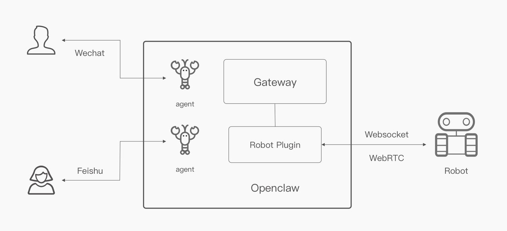

# Openclaw Controls Robot 

## 1. Objective

This chapter is a step-by-step tutorial on how to build an openclaw plugin to communicate with a robot.  

   

     
   
  

&nbsp;
## 2. Plugin vs skill
