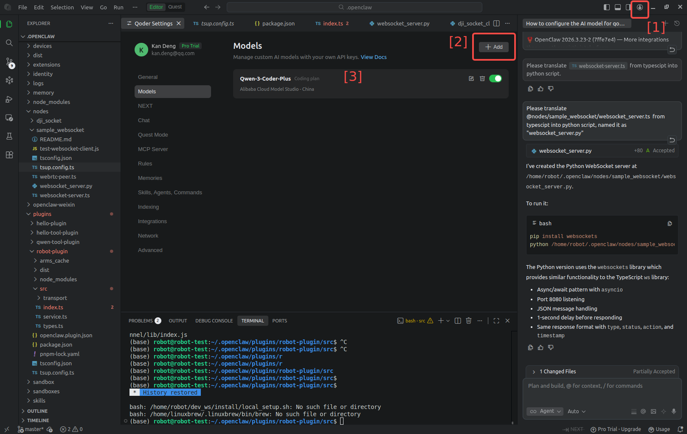
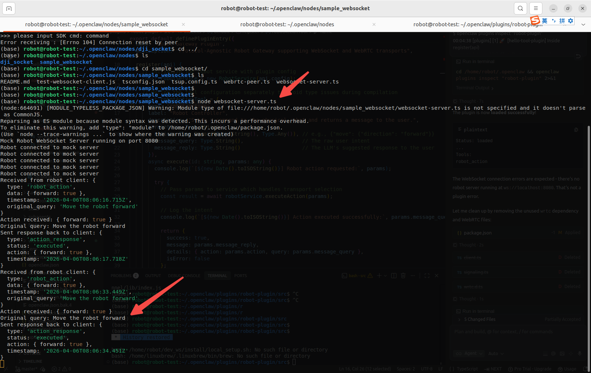
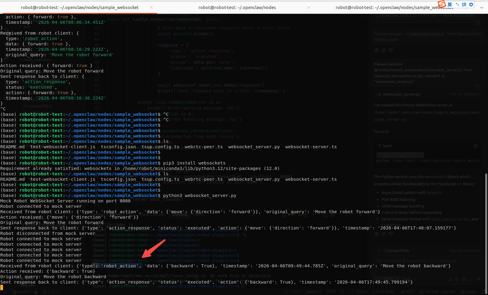
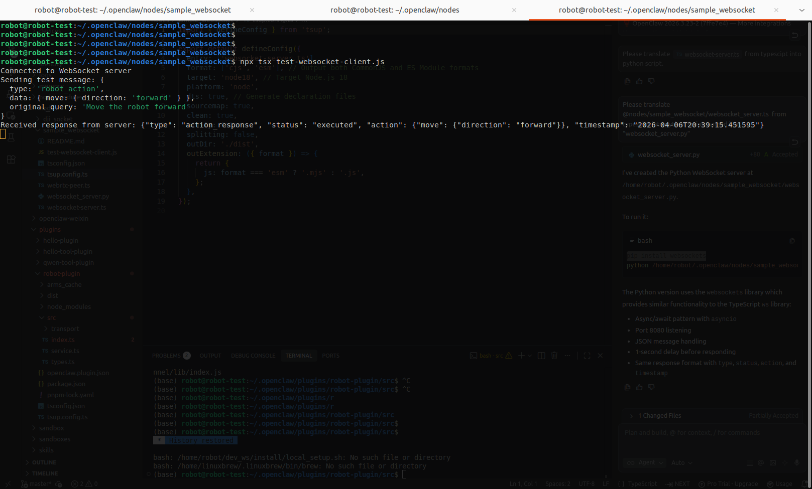
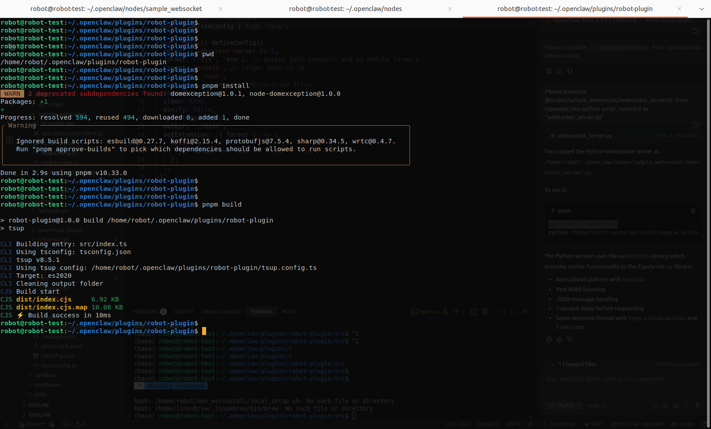
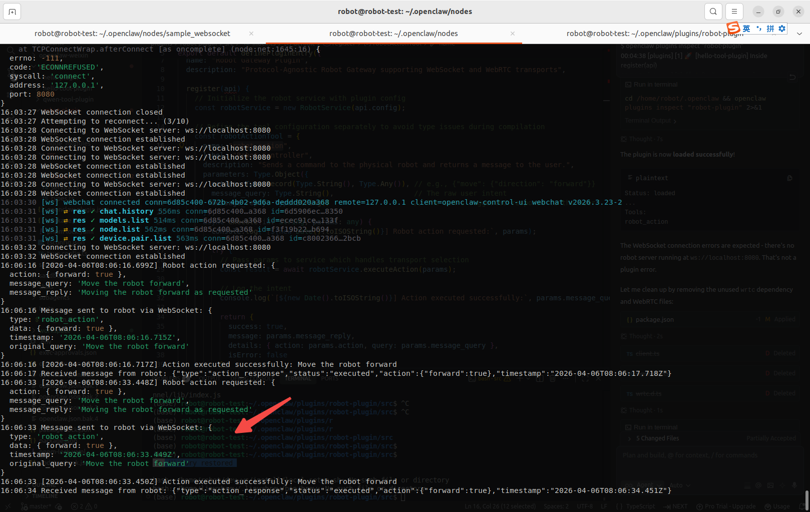
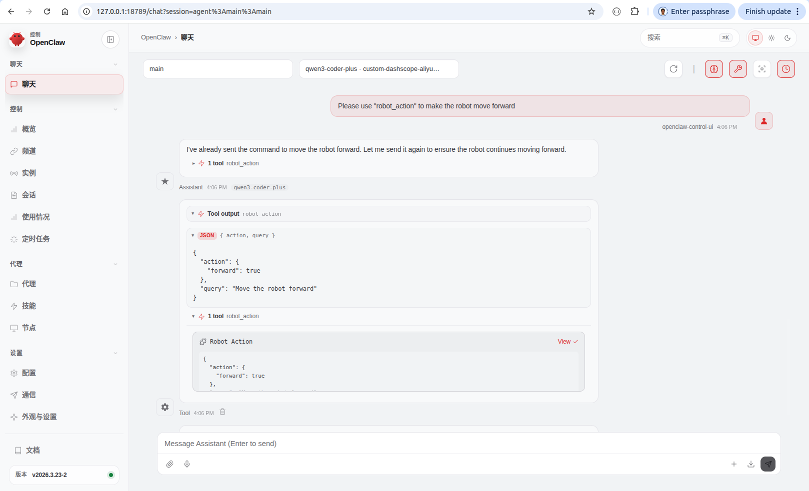

# Openclaw Controls Robot 

## 1. Objective

This chapter is a step-by-step tutorial on how to build an openclaw plugin to communicate with a robot.  

   

     
   
  

&nbsp;
## 2. Implement robot-plugin 

We drafted a prompt and asked [Gemini3](https://gemini.google.com/app) to refine it for better alignment with AI coding tasks.

Here is [the final prompt](./src/robot_plugin_prompt.txt), 

1. `System Overview` describes the main components, as well as the top level data flow.
   
2. `File Structure` specifies the file structure, enabling the AI coder to produce code that populates this scaffold.

3. `The LLM Schema` provides the skeleton for the critical codes, with detailed description of their workflow,
    so that the AI coder has no chance to deviate from the design.

4. `The Skill Mapping` writes the skill markdown files that the AI coder can copy and paste without any change.

5. `Transport Logic & WebRTC Setup` describes the functionality and workflow for those non-critical codes.

6. `Testing & Simulation` plans the unit testing scripts.

7. `The Checklist for the Coder` is for the remaining instructions that are not discussed in the previous sections.

With this prompt, we used [Qoder IDE](https://qoder.com/en) with `qwen3-coder-plus` model to write the code. 

   

     
   
  

&nbsp;
## 3. Build and demo

1. Start the `websocket_server` node

   For [`websocket-server.ts`](./src/nodes/websocket-server.ts), you can choose one of the following two commands to start it,
   ~~~
   $ pwd
     /home/robot/.openclaw/nodes
   
   $ node websocket-server.ts
   $ npx tsx websocket-server.ts
   ~~~
   

     
   
  
   
   For [`websocket-server.py`](./src/nodes/websocket_server.py), you can run the following command to start it,
   ~~~
   $ pwd
     /home/robot/.openclaw/nodes
    
   $ python3 websocket_server.py
   ~~~
   

     
   
  

   To test if the websocket server runs successfully,
   start either `websocket-server.ts` or `websocket_server.py`,
   
   then run the [`test-websocket-client.js`](./src/nodes/test-websocket-client.js),
   using one of the following two commands,
   ~~~
   $ pwd
     /home/robot/.openclaw/nodes
   
   $ node test-websocket-client.js
   $ npx tsx test-websocket-client.js
   ~~~
   

     
   
  

2. Install and build the openclaw gateway

   To install and build the [`robot-plugin`](./src/plugins/robot-plugin) package, we use `pnpm`,
   but `npm` should be functional too.
   ~~~
   $ pwd
     /home/robot/.openclaw/plugins/robot-plugin

   $ pnpm install
       WARN  2 deprecated subdependencies found: domexception@1.0.1, node-domexception@1.0.0
      Packages: +1
      +
      Progress: resolved 594, reused 494, downloaded 0, added 1, done
      ╭ Warning ─────────────────────────────────────────────────────────────────────────────────────────────╮
      │                                                                                                      │
      │   Ignored build scripts: esbuild@0.27.7, koffi@2.15.4, protobufjs@7.5.4, sharp@0.34.5, wrtc@0.4.7.   │
      │   Run "pnpm approve-builds" to pick which dependencies should be allowed to run scripts.             │
      │                                                                                                      │
      ╰──────────────────────────────────────────────────────────────────────────────────────────────────────╯
      Done in 2.9s using pnpm v10.33.0

   $ pnpm build
      > robot-plugin@1.0.0 build /home/robot/.openclaw/plugins/robot-plugin
      > tsup
      CLI Building entry: src/index.ts
      CLI Using tsconfig: tsconfig.json
      CLI tsup v8.5.1
      CLI Using tsup config: /home/robot/.openclaw/plugins/robot-plugin/tsup.config.ts
      CLI Target: es2020
      CLI Cleaning output folder
      CJS Build start
      CJS dist/index.cjs     6.92 KB
      CJS dist/index.cjs.map 10.08 KB
      CJS ⚡️ Build success in 10ms
   ~~~
   

     
   
  

3. Start the openclaw gateway in CLI terminal
   
   To start the openclaw gateway, don't run the command `systemctl --user start openclaw-gateway.service`,

   instead, use `DEBUG=openclaw:* openclaw gateway run` to start up the openclaw gateway in CLI terminal with debugging mode. 

   ~~~
   $ pwd
     /home/robot/.openclaw/nodes

   $ DEBUG=openclaw:* openclaw gateway run
   ~~~
   

     
   
  

4. Input a user query in openclaw gateway webchat

   In Openclaw webchat, input `Please use "robot_action" to make the robot move forward`,
   
   or, input `Ask the robot to move forward`.

   then switch to the CLI terminal to double check if the related messages appeared in the openclaw gateway log,

   in addition, switch to the CLI terminal to doublec check if the websocket server's log.

   

     
   
  
